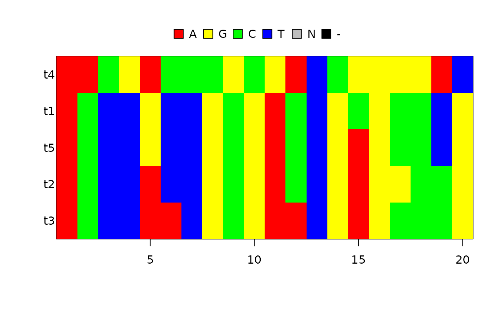

# beautier demo

## Introduction


The purpose of `beautier` is to create a valid `BEAST2` XML input file
from its function argument. In this way, a scientific pipeline using
`BEAST2` can be fully scripted, instead of using `BEAUti`’s GUI.

`beautier` is part of the `babette` package suite (website at
<https://github.com/ropensci/babette>). `babette` allows to use BEAST2
(and its tools) from R.

## Demonstration

First, `beautier` is loaded:

``` r

library(beautier)
```

A BEAST2 XML input file needs an alignment (as BEAST2 infers phylogenies
and parameters on DNA sequences). This demonstration uses a testing
FASTA file used by `beautier`:

``` r

fasta_filename <- get_beautier_path("test_output_0.fas")
```

We can display the alignment in the file:

``` r

image(ape::read.FASTA(fasta_filename))
```



Specify the filename for our XML file, here I use a temporary filename,
so there is no need to clean up afterwards:

``` r
output_filename <- get_beautier_tempfilename()
output_filename
[1] "~/.cache/beautier/file1e372864133e"
```

Now we can create our XML file. We do not specify any inference model,
and just use the BEAUti default settings:


``` r

create_beast2_input_file(
  fasta_filename,
  output_filename
)
```

The file indeed is a BEAST2 input file:

``` r
readLines(output_filename)
  [1] "<?xml version=\"1.0\" encoding=\"UTF-8\" standalone=\"no\"?><beast beautitemplate='Standard' beautistatus='' namespace=\"beast.core:beast.evolution.alignment:beast.evolution.tree.coalescent:beast.core.util:beast.evolution.nuc:beast.evolution.operators:beast.evolution.sitemodel:beast.evolution.substitutionmodel:beast.evolution.likelihood\" required=\"\" version=\"2.4\">"
  [2] ""                                                                                                                                                                                                                                                                                                                                                                                   
  [3] ""                                                                                                                                                                                                                                                                                                                                                                                   
  [4] "    <data"                                                                                                                                                                                                                                                                                                                                                                          
  [5] "id=\"test_output_0\""                                                                                                                                                                                                                                                                                                                                                               
  [6] "name=\"alignment\">"                                                                                                                                                                                                                                                                                                                                                                
  [7] "                    <sequence id=\"seq_t1\" taxon=\"t1\" totalcount=\"4\" value=\"acttgttgcgactgcgcctg\"/>"                                                                                                                                                                                                                                                                         
  [8] "                    <sequence id=\"seq_t2\" taxon=\"t2\" totalcount=\"4\" value=\"acttattgcgactgaggccg\"/>"                                                                                                                                                                                                                                                                         
  [9] "                    <sequence id=\"seq_t3\" taxon=\"t3\" totalcount=\"4\" value=\"acttaatgcgaatgagcccg\"/>"                                                                                                                                                                                                                                                                         
 [10] "                    <sequence id=\"seq_t4\" taxon=\"t4\" totalcount=\"4\" value=\"aacgacccgcgatcggggat\"/>"                                                                                                                                                                                                                                                                         
 [11] "                    <sequence id=\"seq_t5\" taxon=\"t5\" totalcount=\"4\" value=\"acttgttgcgactgagcctg\"/>"                                                                                                                                                                                                                                                                         
 [12] "                </data>"                                                                                                                                                                                                                                                                                                                                                            
 [13] ""                                                                                                                                                                                                                                                                                                                                                                                   
 [14] ""                                                                                                                                                                                                                                                                                                                                                                                   
 [15] "    "                                                                                                                                                                                                                                                                                                                                                                               
 [16] ""                                                                                                                                                                                                                                                                                                                                                                                   
 [17] ""                                                                                                                                                                                                                                                                                                                                                                                   
 [18] "    "                                                                                                                                                                                                                                                                                                                                                                               
 [19] ""                                                                                                                                                                                                                                                                                                                                                                                   
 [20] ""                                                                                                                                                                                                                                                                                                                                                                                   
 [21] "    "                                                                                                                                                                                                                                                                                                                                                                               
 [22] "<map name=\"Uniform\" >beast.math.distributions.Uniform</map>"                                                                                                                                                                                                                                                                                                                      
 [23] "<map name=\"Exponential\" >beast.math.distributions.Exponential</map>"                                                                                                                                                                                                                                                                                                              
 [24] "<map name=\"LogNormal\" >beast.math.distributions.LogNormalDistributionModel</map>"                                                                                                                                                                                                                                                                                                 
 [25] "<map name=\"Normal\" >beast.math.distributions.Normal</map>"                                                                                                                                                                                                                                                                                                                        
 [26] "<map name=\"Beta\" >beast.math.distributions.Beta</map>"                                                                                                                                                                                                                                                                                                                            
 [27] "<map name=\"Gamma\" >beast.math.distributions.Gamma</map>"                                                                                                                                                                                                                                                                                                                          
 [28] "<map name=\"LaplaceDistribution\" >beast.math.distributions.LaplaceDistribution</map>"                                                                                                                                                                                                                                                                                              
 [29] "<map name=\"prior\" >beast.math.distributions.Prior</map>"                                                                                                                                                                                                                                                                                                                          
 [30] "<map name=\"InverseGamma\" >beast.math.distributions.InverseGamma</map>"                                                                                                                                                                                                                                                                                                            
 [31] "<map name=\"OneOnX\" >beast.math.distributions.OneOnX</map>"                                                                                                                                                                                                                                                                                                                        
 [32] ""                                                                                                                                                                                                                                                                                                                                                                                   
 [33] ""                                                                                                                                                                                                                                                                                                                                                                                   
 [34] "<run id=\"mcmc\" spec=\"MCMC\" chainLength=\"10000000\">"                                                                                                                                                                                                                                                                                                                           
 [35] "    <state id=\"state\" storeEvery=\"5000\">"                                                                                                                                                                                                                                                                                                                                       
 [36] "        <tree id=\"Tree.t:test_output_0\" name=\"stateNode\">"                                                                                                                                                                                                                                                                                                                      
 [37] "            <taxonset id=\"TaxonSet.test_output_0\" spec=\"TaxonSet\">"                                                                                                                                                                                                                                                                                                             
 [38] "                <alignment idref=\"test_output_0\"/>"                                                                                                                                                                                                                                                                                                                               
 [39] "            </taxonset>"                                                                                                                                                                                                                                                                                                                                                            
 [40] "        </tree>"                                                                                                                                                                                                                                                                                                                                                                    
 [41] "        <parameter id=\"birthRate.t:test_output_0\" name=\"stateNode\">1.0</parameter>"                                                                                                                                                                                                                                                                                             
 [42] "    </state>"                                                                                                                                                                                                                                                                                                                                                                       
 [43] ""                                                                                                                                                                                                                                                                                                                                                                                   
 [44] "    <init id=\"RandomTree.t:test_output_0\" spec=\"beast.evolution.tree.RandomTree\" estimate=\"false\" initial=\"@Tree.t:test_output_0\" taxa=\"@test_output_0\">"                                                                                                                                                                                                                 
 [45] "        <populationModel id=\"ConstantPopulation0.t:test_output_0\" spec=\"ConstantPopulation\">"                                                                                                                                                                                                                                                                                   
 [46] "            <parameter id=\"randomPopSize.t:test_output_0\" name=\"popSize\">1.0</parameter>"                                                                                                                                                                                                                                                                                       
 [47] "        </populationModel>"                                                                                                                                                                                                                                                                                                                                                         
 [48] "    </init>"                                                                                                                                                                                                                                                                                                                                                                        
 [49] ""                                                                                                                                                                                                                                                                                                                                                                                   
 [50] "    <distribution id=\"posterior\" spec=\"util.CompoundDistribution\">"                                                                                                                                                                                                                                                                                                             
 [51] "        <distribution id=\"prior\" spec=\"util.CompoundDistribution\">"                                                                                                                                                                                                                                                                                                             
 [52] "            <distribution id=\"YuleModel.t:test_output_0\" spec=\"beast.evolution.speciation.YuleModel\" birthDiffRate=\"@birthRate.t:test_output_0\" tree=\"@Tree.t:test_output_0\"/>"                                                                                                                                                                                             
 [53] "            <prior id=\"YuleBirthRatePrior.t:test_output_0\" name=\"distribution\" x=\"@birthRate.t:test_output_0\">"                                                                                                                                                                                                                                                               
 [54] "                <Uniform id=\"Uniform.100\" name=\"distr\" upper=\"Infinity\"/>"                                                                                                                                                                                                                                                                                                    
 [55] "            </prior>"                                                                                                                                                                                                                                                                                                                                                               
 [56] "        </distribution>"                                                                                                                                                                                                                                                                                                                                                            
 [57] "        <distribution id=\"likelihood\" spec=\"util.CompoundDistribution\" useThreads=\"true\">"                                                                                                                                                                                                                                                                                    
 [58] "            <distribution id=\"treeLikelihood.test_output_0\" spec=\"ThreadedTreeLikelihood\" data=\"@test_output_0\" tree=\"@Tree.t:test_output_0\">"                                                                                                                                                                                                                              
 [59] "                <siteModel id=\"SiteModel.s:test_output_0\" spec=\"SiteModel\">"                                                                                                                                                                                                                                                                                                    
 [60] "                    <parameter id=\"mutationRate.s:test_output_0\" estimate=\"false\" name=\"mutationRate\">1.0</parameter>"                                                                                                                                                                                                                                                        
 [61] "                    <parameter id=\"gammaShape.s:test_output_0\" estimate=\"false\" name=\"shape\">1.0</parameter>"                                                                                                                                                                                                                                                                 
 [62] "                    <parameter id=\"proportionInvariant.s:test_output_0\" estimate=\"false\" lower=\"0.0\" name=\"proportionInvariant\" upper=\"1.0\">0.0</parameter>"                                                                                                                                                                                                              
 [63] "                    <substModel id=\"JC69.s:test_output_0\" spec=\"JukesCantor\"/>"                                                                                                                                                                                                                                                                                                 
 [64] "                </siteModel>"                                                                                                                                                                                                                                                                                                                                                       
 [65] "                <branchRateModel id=\"StrictClock.c:test_output_0\" spec=\"beast.evolution.branchratemodel.StrictClockModel\">"                                                                                                                                                                                                                                                     
 [66] "                    <parameter id=\"clockRate.c:test_output_0\" estimate=\"false\" name=\"clock.rate\">1.0</parameter>"                                                                                                                                                                                                                                                             
 [67] "                </branchRateModel>"                                                                                                                                                                                                                                                                                                                                                 
 [68] "            </distribution>"                                                                                                                                                                                                                                                                                                                                                        
 [69] "        </distribution>"                                                                                                                                                                                                                                                                                                                                                            
 [70] "    </distribution>"                                                                                                                                                                                                                                                                                                                                                                
 [71] ""                                                                                                                                                                                                                                                                                                                                                                                   
 [72] "    <operator id=\"YuleBirthRateScaler.t:test_output_0\" spec=\"ScaleOperator\" parameter=\"@birthRate.t:test_output_0\" scaleFactor=\"0.75\" weight=\"3.0\"/>"                                                                                                                                                                                                                     
 [73] ""                                                                                                                                                                                                                                                                                                                                                                                   
 [74] "    <operator id=\"YuleModelTreeScaler.t:test_output_0\" spec=\"ScaleOperator\" scaleFactor=\"0.5\" tree=\"@Tree.t:test_output_0\" weight=\"3.0\"/>"                                                                                                                                                                                                                                
 [75] ""                                                                                                                                                                                                                                                                                                                                                                                   
 [76] "    <operator id=\"YuleModelTreeRootScaler.t:test_output_0\" spec=\"ScaleOperator\" rootOnly=\"true\" scaleFactor=\"0.5\" tree=\"@Tree.t:test_output_0\" weight=\"3.0\"/>"                                                                                                                                                                                                          
 [77] ""                                                                                                                                                                                                                                                                                                                                                                                   
 [78] "    <operator id=\"YuleModelUniformOperator.t:test_output_0\" spec=\"Uniform\" tree=\"@Tree.t:test_output_0\" weight=\"30.0\"/>"                                                                                                                                                                                                                                                    
 [79] ""                                                                                                                                                                                                                                                                                                                                                                                   
 [80] "    <operator id=\"YuleModelSubtreeSlide.t:test_output_0\" spec=\"SubtreeSlide\" tree=\"@Tree.t:test_output_0\" weight=\"15.0\"/>"                                                                                                                                                                                                                                                  
 [81] ""                                                                                                                                                                                                                                                                                                                                                                                   
 [82] "    <operator id=\"YuleModelNarrow.t:test_output_0\" spec=\"Exchange\" tree=\"@Tree.t:test_output_0\" weight=\"15.0\"/>"                                                                                                                                                                                                                                                            
 [83] ""                                                                                                                                                                                                                                                                                                                                                                                   
 [84] "    <operator id=\"YuleModelWide.t:test_output_0\" spec=\"Exchange\" isNarrow=\"false\" tree=\"@Tree.t:test_output_0\" weight=\"3.0\"/>"                                                                                                                                                                                                                                            
 [85] ""                                                                                                                                                                                                                                                                                                                                                                                   
 [86] "    <operator id=\"YuleModelWilsonBalding.t:test_output_0\" spec=\"WilsonBalding\" tree=\"@Tree.t:test_output_0\" weight=\"3.0\"/>"                                                                                                                                                                                                                                                 
 [87] ""                                                                                                                                                                                                                                                                                                                                                                                   
 [88] "    <logger id=\"tracelog\" fileName=\"test_output_0.log\" logEvery=\"1000\" model=\"@posterior\" sanitiseHeaders=\"true\" sort=\"smart\">"                                                                                                                                                                                                                                         
 [89] "        <log idref=\"posterior\"/>"                                                                                                                                                                                                                                                                                                                                                 
 [90] "        <log idref=\"likelihood\"/>"                                                                                                                                                                                                                                                                                                                                                
 [91] "        <log idref=\"prior\"/>"                                                                                                                                                                                                                                                                                                                                                     
 [92] "        <log idref=\"treeLikelihood.test_output_0\"/>"                                                                                                                                                                                                                                                                                                                              
 [93] "        <log id=\"TreeHeight.t:test_output_0\" spec=\"beast.evolution.tree.TreeHeightLogger\" tree=\"@Tree.t:test_output_0\"/>"                                                                                                                                                                                                                                                     
 [94] "        <log idref=\"YuleModel.t:test_output_0\"/>"                                                                                                                                                                                                                                                                                                                                 
 [95] "        <log idref=\"birthRate.t:test_output_0\"/>"                                                                                                                                                                                                                                                                                                                                 
 [96] "    </logger>"                                                                                                                                                                                                                                                                                                                                                                      
 [97] ""                                                                                                                                                                                                                                                                                                                                                                                   
 [98] "    <logger id=\"screenlog\" logEvery=\"1000\">"                                                                                                                                                                                                                                                                                                                                    
 [99] "        <log idref=\"posterior\"/>"                                                                                                                                                                                                                                                                                                                                                 
[100] "        <log id=\"ESS.0\" spec=\"util.ESS\" arg=\"@posterior\"/>"                                                                                                                                                                                                                                                                                                                   
[101] "        <log idref=\"likelihood\"/>"                                                                                                                                                                                                                                                                                                                                                
[102] "        <log idref=\"prior\"/>"                                                                                                                                                                                                                                                                                                                                                     
[103] "    </logger>"                                                                                                                                                                                                                                                                                                                                                                      
[104] ""                                                                                                                                                                                                                                                                                                                                                                                   
[105] "    <logger id=\"treelog.t:test_output_0\" fileName=\"$(tree).trees\" logEvery=\"1000\" mode=\"tree\">"                                                                                                                                                                                                                                                                             
[106] "        <log id=\"TreeWithMetaDataLogger.t:test_output_0\" spec=\"beast.evolution.tree.TreeWithMetaDataLogger\" tree=\"@Tree.t:test_output_0\"/>"                                                                                                                                                                                                                                   
[107] "    </logger>"                                                                                                                                                                                                                                                                                                                                                                      
[108] ""                                                                                                                                                                                                                                                                                                                                                                                   
[109] "</run>"                                                                                                                                                                                                                                                                                                                                                                             
[110] ""                                                                                                                                                                                                                                                                                                                                                                                   
[111] "</beast>"                                                                                                                                                                                                                                                                                                                                                                           
```

This XML input file can be read by BEAST2.

You can use `beastier` to run BEAST2 from R, see
<https://github.com/ropensci/beastier>. You can use `babette` to do a
BEAST2 inference directly, see <https://github.com/ropensci/babette>.

### Cleanup

``` r
file.remove(output_filename)
[1] TRUE

beautier::remove_beautier_folder()
beautier::check_empty_beautier_folder()
```
