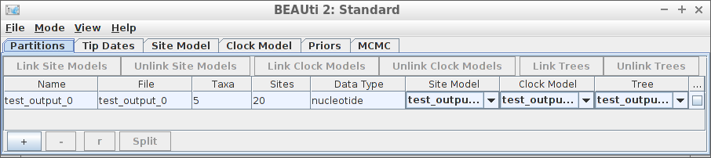
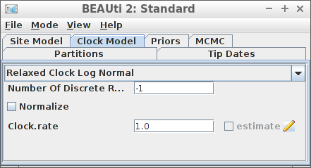
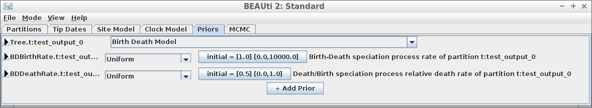
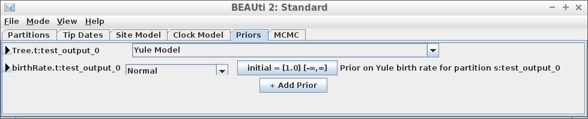
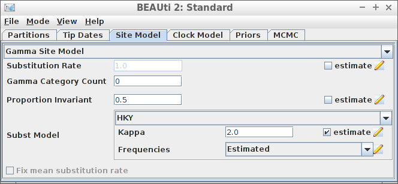
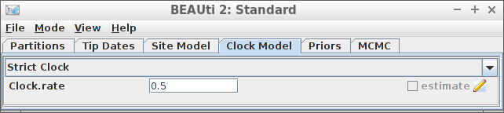
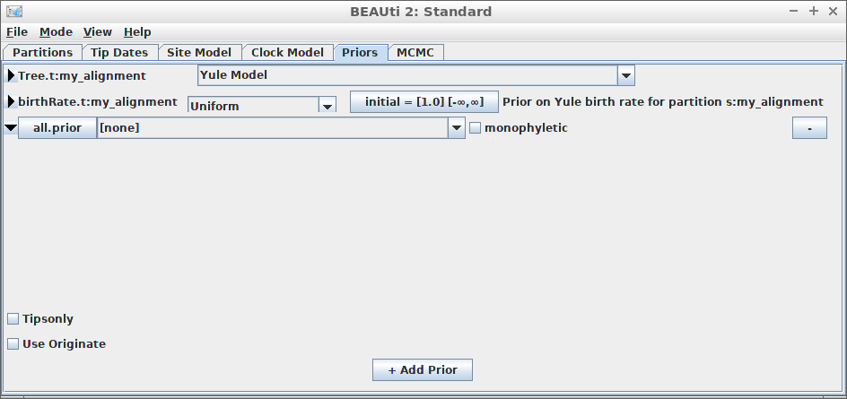
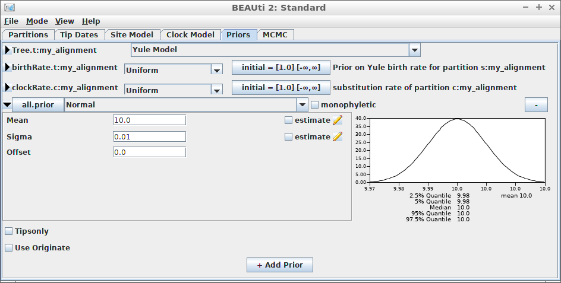

# Examples

## Introduction


The purpose of `beautier` is to create a valid `BEAST2` XML input file
from its function argument. In this way, a scientific pipeline using
`BEAST2` can be fully scripted, instead of using `BEAUti`’s GUI.

`beautier` is part of the `babette` package suite (website at
<https://github.com/ropensci/babette>). `babette` allows to use BEAST2
(and its tools) from R.

## Getting started

For all examples, do load `beautier`:

``` r

library(beautier)
```

Each example shows a picture of a BEAUti dialog to achieve the same.
BEAUti is part of the BEAST2 tool suite and it’s a GUI to create BEAST2
input files. `beautier` is an R package to supplement BEAUti, by
providing to do the same from an R script.

Each example reads the alignment from a FASTA file called
`anthus_aco_sub.fas`, which is part of the files supplied with
`beautier`:

``` r

input_filename <- get_beautier_path("anthus_aco_sub.fas")
```

In this vignette, the generated BEAST2 XML is shown. Use
`create_beast2_input_file` to save the resulting XML directly to file
instead.

### Example \#1: all default



Using all default settings, only specify a DNA alignment.

``` r
create_beast2_input(
  input_filename
)
  [1] "<?xml version=\"1.0\" encoding=\"UTF-8\" standalone=\"no\"?><beast beautitemplate='Standard' beautistatus='' namespace=\"beast.core:beast.evolution.alignment:beast.evolution.tree.coalescent:beast.core.util:beast.evolution.nuc:beast.evolution.operators:beast.evolution.sitemodel:beast.evolution.substitutionmodel:beast.evolution.likelihood\" required=\"\" version=\"2.4\">"
  [2] ""                                                                                                                                                                                                                                                                                                                                                                                   
  [3] ""                                                                                                                                                                                                                                                                                                                                                                                   
  [4] "    <data"                                                                                                                                                                                                                                                                                                                                                                          
  [5] "id=\"anthus_aco_sub\""                                                                                                                                                                                                                                                                                                                                                              
  [6] "name=\"alignment\">"                                                                                                                                                                                                                                                                                                                                                                
  [7] "                    <sequence id=\"seq_61430_aco\" taxon=\"61430_aco\" totalcount=\"4\" value=\"acaggttagaaactactctgttttctggctccttgtttaatgccctgtcctattttattgcgaaaattgtctgttttt\"/>"                                                                                                                                                                                                 
  [8] "                    <sequence id=\"seq_626029_aco\" taxon=\"626029_aco\" totalcount=\"4\" value=\"acaggttagaaactactctgttttctggctgcttgtttaatgccctctcctattttattgtgacgattgtctgttttt\"/>"                                                                                                                                                                                               
  [9] "                    <sequence id=\"seq_630116_aco\" taxon=\"630116_aco\" totalcount=\"4\" value=\"acaggttagaaactactctgttttctggctccttgtttaatgccctgtcctattttattgcgaaaattgtctgttttt\"/>"                                                                                                                                                                                               
 [10] "                    <sequence id=\"seq_630210_aco\" taxon=\"630210_aco\" totalcount=\"4\" value=\"acaggttagaaactactctgttttctggctccttgtttaatgccctgtcctattttattgtgacaattgtctgttttt\"/>"                                                                                                                                                                                               
 [11] "                    <sequence id=\"seq_B25702_aco\" taxon=\"B25702_aco\" totalcount=\"4\" value=\"acaggttagaaactactctgttttctggctccttgtttaatgccctgtcctattttattgtgacaattgtctgttttt\"/>"                                                                                                                                                                                               
 [12] "                </data>"                                                                                                                                                                                                                                                                                                                                                            
 [13] ""                                                                                                                                                                                                                                                                                                                                                                                   
 [14] ""                                                                                                                                                                                                                                                                                                                                                                                   
 [15] "    "                                                                                                                                                                                                                                                                                                                                                                               
 [16] ""                                                                                                                                                                                                                                                                                                                                                                                   
 [17] ""                                                                                                                                                                                                                                                                                                                                                                                   
 [18] "    "                                                                                                                                                                                                                                                                                                                                                                               
 [19] ""                                                                                                                                                                                                                                                                                                                                                                                   
 [20] ""                                                                                                                                                                                                                                                                                                                                                                                   
 [21] "    "                                                                                                                                                                                                                                                                                                                                                                               
 [22] "<map name=\"Uniform\" >beast.math.distributions.Uniform</map>"                                                                                                                                                                                                                                                                                                                      
 [23] "<map name=\"Exponential\" >beast.math.distributions.Exponential</map>"                                                                                                                                                                                                                                                                                                              
 [24] "<map name=\"LogNormal\" >beast.math.distributions.LogNormalDistributionModel</map>"                                                                                                                                                                                                                                                                                                 
 [25] "<map name=\"Normal\" >beast.math.distributions.Normal</map>"                                                                                                                                                                                                                                                                                                                        
 [26] "<map name=\"Beta\" >beast.math.distributions.Beta</map>"                                                                                                                                                                                                                                                                                                                            
 [27] "<map name=\"Gamma\" >beast.math.distributions.Gamma</map>"                                                                                                                                                                                                                                                                                                                          
 [28] "<map name=\"LaplaceDistribution\" >beast.math.distributions.LaplaceDistribution</map>"                                                                                                                                                                                                                                                                                              
 [29] "<map name=\"prior\" >beast.math.distributions.Prior</map>"                                                                                                                                                                                                                                                                                                                          
 [30] "<map name=\"InverseGamma\" >beast.math.distributions.InverseGamma</map>"                                                                                                                                                                                                                                                                                                            
 [31] "<map name=\"OneOnX\" >beast.math.distributions.OneOnX</map>"                                                                                                                                                                                                                                                                                                                        
 [32] ""                                                                                                                                                                                                                                                                                                                                                                                   
 [33] ""                                                                                                                                                                                                                                                                                                                                                                                   
 [34] "<run id=\"mcmc\" spec=\"MCMC\" chainLength=\"10000000\">"                                                                                                                                                                                                                                                                                                                           
 [35] "    <state id=\"state\" storeEvery=\"5000\">"                                                                                                                                                                                                                                                                                                                                       
 [36] "        <tree id=\"Tree.t:anthus_aco_sub\" name=\"stateNode\">"                                                                                                                                                                                                                                                                                                                     
 [37] "            <taxonset id=\"TaxonSet.anthus_aco_sub\" spec=\"TaxonSet\">"                                                                                                                                                                                                                                                                                                            
 [38] "                <alignment idref=\"anthus_aco_sub\"/>"                                                                                                                                                                                                                                                                                                                              
 [39] "            </taxonset>"                                                                                                                                                                                                                                                                                                                                                            
 [40] "        </tree>"                                                                                                                                                                                                                                                                                                                                                                    
 [41] "        <parameter id=\"birthRate.t:anthus_aco_sub\" name=\"stateNode\">1.0</parameter>"                                                                                                                                                                                                                                                                                            
 [42] "    </state>"                                                                                                                                                                                                                                                                                                                                                                       
 [43] ""                                                                                                                                                                                                                                                                                                                                                                                   
 [44] "    <init id=\"RandomTree.t:anthus_aco_sub\" spec=\"beast.evolution.tree.RandomTree\" estimate=\"false\" initial=\"@Tree.t:anthus_aco_sub\" taxa=\"@anthus_aco_sub\">"                                                                                                                                                                                                              
 [45] "        <populationModel id=\"ConstantPopulation0.t:anthus_aco_sub\" spec=\"ConstantPopulation\">"                                                                                                                                                                                                                                                                                  
 [46] "            <parameter id=\"randomPopSize.t:anthus_aco_sub\" name=\"popSize\">1.0</parameter>"                                                                                                                                                                                                                                                                                      
 [47] "        </populationModel>"                                                                                                                                                                                                                                                                                                                                                         
 [48] "    </init>"                                                                                                                                                                                                                                                                                                                                                                        
 [49] ""                                                                                                                                                                                                                                                                                                                                                                                   
 [50] "    <distribution id=\"posterior\" spec=\"util.CompoundDistribution\">"                                                                                                                                                                                                                                                                                                             
 [51] "        <distribution id=\"prior\" spec=\"util.CompoundDistribution\">"                                                                                                                                                                                                                                                                                                             
 [52] "            <distribution id=\"YuleModel.t:anthus_aco_sub\" spec=\"beast.evolution.speciation.YuleModel\" birthDiffRate=\"@birthRate.t:anthus_aco_sub\" tree=\"@Tree.t:anthus_aco_sub\"/>"                                                                                                                                                                                          
 [53] "            <prior id=\"YuleBirthRatePrior.t:anthus_aco_sub\" name=\"distribution\" x=\"@birthRate.t:anthus_aco_sub\">"                                                                                                                                                                                                                                                             
 [54] "                <Uniform id=\"Uniform.100\" name=\"distr\" upper=\"Infinity\"/>"                                                                                                                                                                                                                                                                                                    
 [55] "            </prior>"                                                                                                                                                                                                                                                                                                                                                               
 [56] "        </distribution>"                                                                                                                                                                                                                                                                                                                                                            
 [57] "        <distribution id=\"likelihood\" spec=\"util.CompoundDistribution\" useThreads=\"true\">"                                                                                                                                                                                                                                                                                    
 [58] "            <distribution id=\"treeLikelihood.anthus_aco_sub\" spec=\"ThreadedTreeLikelihood\" data=\"@anthus_aco_sub\" tree=\"@Tree.t:anthus_aco_sub\">"                                                                                                                                                                                                                           
 [59] "                <siteModel id=\"SiteModel.s:anthus_aco_sub\" spec=\"SiteModel\">"                                                                                                                                                                                                                                                                                                   
 [60] "                    <parameter id=\"mutationRate.s:anthus_aco_sub\" estimate=\"false\" name=\"mutationRate\">1.0</parameter>"                                                                                                                                                                                                                                                       
 [61] "                    <parameter id=\"gammaShape.s:anthus_aco_sub\" estimate=\"false\" name=\"shape\">1.0</parameter>"                                                                                                                                                                                                                                                                
 [62] "                    <parameter id=\"proportionInvariant.s:anthus_aco_sub\" estimate=\"false\" lower=\"0.0\" name=\"proportionInvariant\" upper=\"1.0\">0.0</parameter>"                                                                                                                                                                                                             
 [63] "                    <substModel id=\"JC69.s:anthus_aco_sub\" spec=\"JukesCantor\"/>"                                                                                                                                                                                                                                                                                                
 [64] "                </siteModel>"                                                                                                                                                                                                                                                                                                                                                       
 [65] "                <branchRateModel id=\"StrictClock.c:anthus_aco_sub\" spec=\"beast.evolution.branchratemodel.StrictClockModel\">"                                                                                                                                                                                                                                                    
 [66] "                    <parameter id=\"clockRate.c:anthus_aco_sub\" estimate=\"false\" name=\"clock.rate\">1.0</parameter>"                                                                                                                                                                                                                                                            
 [67] "                </branchRateModel>"                                                                                                                                                                                                                                                                                                                                                 
 [68] "            </distribution>"                                                                                                                                                                                                                                                                                                                                                        
 [69] "        </distribution>"                                                                                                                                                                                                                                                                                                                                                            
 [70] "    </distribution>"                                                                                                                                                                                                                                                                                                                                                                
 [71] ""                                                                                                                                                                                                                                                                                                                                                                                   
 [72] "    <operator id=\"YuleBirthRateScaler.t:anthus_aco_sub\" spec=\"ScaleOperator\" parameter=\"@birthRate.t:anthus_aco_sub\" scaleFactor=\"0.75\" weight=\"3.0\"/>"                                                                                                                                                                                                                   
 [73] ""                                                                                                                                                                                                                                                                                                                                                                                   
 [74] "    <operator id=\"YuleModelTreeScaler.t:anthus_aco_sub\" spec=\"ScaleOperator\" scaleFactor=\"0.5\" tree=\"@Tree.t:anthus_aco_sub\" weight=\"3.0\"/>"                                                                                                                                                                                                                              
 [75] ""                                                                                                                                                                                                                                                                                                                                                                                   
 [76] "    <operator id=\"YuleModelTreeRootScaler.t:anthus_aco_sub\" spec=\"ScaleOperator\" rootOnly=\"true\" scaleFactor=\"0.5\" tree=\"@Tree.t:anthus_aco_sub\" weight=\"3.0\"/>"                                                                                                                                                                                                        
 [77] ""                                                                                                                                                                                                                                                                                                                                                                                   
 [78] "    <operator id=\"YuleModelUniformOperator.t:anthus_aco_sub\" spec=\"Uniform\" tree=\"@Tree.t:anthus_aco_sub\" weight=\"30.0\"/>"                                                                                                                                                                                                                                                  
 [79] ""                                                                                                                                                                                                                                                                                                                                                                                   
 [80] "    <operator id=\"YuleModelSubtreeSlide.t:anthus_aco_sub\" spec=\"SubtreeSlide\" tree=\"@Tree.t:anthus_aco_sub\" weight=\"15.0\"/>"                                                                                                                                                                                                                                                
 [81] ""                                                                                                                                                                                                                                                                                                                                                                                   
 [82] "    <operator id=\"YuleModelNarrow.t:anthus_aco_sub\" spec=\"Exchange\" tree=\"@Tree.t:anthus_aco_sub\" weight=\"15.0\"/>"                                                                                                                                                                                                                                                          
 [83] ""                                                                                                                                                                                                                                                                                                                                                                                   
 [84] "    <operator id=\"YuleModelWide.t:anthus_aco_sub\" spec=\"Exchange\" isNarrow=\"false\" tree=\"@Tree.t:anthus_aco_sub\" weight=\"3.0\"/>"                                                                                                                                                                                                                                          
 [85] ""                                                                                                                                                                                                                                                                                                                                                                                   
 [86] "    <operator id=\"YuleModelWilsonBalding.t:anthus_aco_sub\" spec=\"WilsonBalding\" tree=\"@Tree.t:anthus_aco_sub\" weight=\"3.0\"/>"                                                                                                                                                                                                                                               
 [87] ""                                                                                                                                                                                                                                                                                                                                                                                   
 [88] "    <logger id=\"tracelog\" fileName=\"anthus_aco_sub.log\" logEvery=\"1000\" model=\"@posterior\" sanitiseHeaders=\"true\" sort=\"smart\">"                                                                                                                                                                                                                                        
 [89] "        <log idref=\"posterior\"/>"                                                                                                                                                                                                                                                                                                                                                 
 [90] "        <log idref=\"likelihood\"/>"                                                                                                                                                                                                                                                                                                                                                
 [91] "        <log idref=\"prior\"/>"                                                                                                                                                                                                                                                                                                                                                     
 [92] "        <log idref=\"treeLikelihood.anthus_aco_sub\"/>"                                                                                                                                                                                                                                                                                                                             
 [93] "        <log id=\"TreeHeight.t:anthus_aco_sub\" spec=\"beast.evolution.tree.TreeHeightLogger\" tree=\"@Tree.t:anthus_aco_sub\"/>"                                                                                                                                                                                                                                                   
 [94] "        <log idref=\"YuleModel.t:anthus_aco_sub\"/>"                                                                                                                                                                                                                                                                                                                                
 [95] "        <log idref=\"birthRate.t:anthus_aco_sub\"/>"                                                                                                                                                                                                                                                                                                                                
 [96] "    </logger>"                                                                                                                                                                                                                                                                                                                                                                      
 [97] ""                                                                                                                                                                                                                                                                                                                                                                                   
 [98] "    <logger id=\"screenlog\" logEvery=\"1000\">"                                                                                                                                                                                                                                                                                                                                    
 [99] "        <log idref=\"posterior\"/>"                                                                                                                                                                                                                                                                                                                                                 
[100] "        <log id=\"ESS.0\" spec=\"util.ESS\" arg=\"@posterior\"/>"                                                                                                                                                                                                                                                                                                                   
[101] "        <log idref=\"likelihood\"/>"                                                                                                                                                                                                                                                                                                                                                
[102] "        <log idref=\"prior\"/>"                                                                                                                                                                                                                                                                                                                                                     
[103] "    </logger>"                                                                                                                                                                                                                                                                                                                                                                      
[104] ""                                                                                                                                                                                                                                                                                                                                                                                   
[105] "    <logger id=\"treelog.t:anthus_aco_sub\" fileName=\"$(tree).trees\" logEvery=\"1000\" mode=\"tree\">"                                                                                                                                                                                                                                                                            
[106] "        <log id=\"TreeWithMetaDataLogger.t:anthus_aco_sub\" spec=\"beast.evolution.tree.TreeWithMetaDataLogger\" tree=\"@Tree.t:anthus_aco_sub\"/>"                                                                                                                                                                                                                                 
[107] "    </logger>"                                                                                                                                                                                                                                                                                                                                                                      
[108] ""                                                                                                                                                                                                                                                                                                                                                                                   
[109] "</run>"                                                                                                                                                                                                                                                                                                                                                                             
[110] ""                                                                                                                                                                                                                                                                                                                                                                                   
[111] "</beast>"                                                                                                                                                                                                                                                                                                                                                                           
```

All other parameters are set to their defaults, as in BEAUti.

### Example \#2: JC69 site model


``` r
create_beast2_input(
  input_filename,
  site_model = create_jc69_site_model()
)
  [1] "<?xml version=\"1.0\" encoding=\"UTF-8\" standalone=\"no\"?><beast beautitemplate='Standard' beautistatus='' namespace=\"beast.core:beast.evolution.alignment:beast.evolution.tree.coalescent:beast.core.util:beast.evolution.nuc:beast.evolution.operators:beast.evolution.sitemodel:beast.evolution.substitutionmodel:beast.evolution.likelihood\" required=\"\" version=\"2.4\">"
  [2] ""                                                                                                                                                                                                                                                                                                                                                                                   
  [3] ""                                                                                                                                                                                                                                                                                                                                                                                   
  [4] "    <data"                                                                                                                                                                                                                                                                                                                                                                          
  [5] "id=\"anthus_aco_sub\""                                                                                                                                                                                                                                                                                                                                                              
  [6] "name=\"alignment\">"                                                                                                                                                                                                                                                                                                                                                                
  [7] "                    <sequence id=\"seq_61430_aco\" taxon=\"61430_aco\" totalcount=\"4\" value=\"acaggttagaaactactctgttttctggctccttgtttaatgccctgtcctattttattgcgaaaattgtctgttttt\"/>"                                                                                                                                                                                                 
  [8] "                    <sequence id=\"seq_626029_aco\" taxon=\"626029_aco\" totalcount=\"4\" value=\"acaggttagaaactactctgttttctggctgcttgtttaatgccctctcctattttattgtgacgattgtctgttttt\"/>"                                                                                                                                                                                               
  [9] "                    <sequence id=\"seq_630116_aco\" taxon=\"630116_aco\" totalcount=\"4\" value=\"acaggttagaaactactctgttttctggctccttgtttaatgccctgtcctattttattgcgaaaattgtctgttttt\"/>"                                                                                                                                                                                               
 [10] "                    <sequence id=\"seq_630210_aco\" taxon=\"630210_aco\" totalcount=\"4\" value=\"acaggttagaaactactctgttttctggctccttgtttaatgccctgtcctattttattgtgacaattgtctgttttt\"/>"                                                                                                                                                                                               
 [11] "                    <sequence id=\"seq_B25702_aco\" taxon=\"B25702_aco\" totalcount=\"4\" value=\"acaggttagaaactactctgttttctggctccttgtttaatgccctgtcctattttattgtgacaattgtctgttttt\"/>"                                                                                                                                                                                               
 [12] "                </data>"                                                                                                                                                                                                                                                                                                                                                            
 [13] ""                                                                                                                                                                                                                                                                                                                                                                                   
 [14] ""                                                                                                                                                                                                                                                                                                                                                                                   
 [15] "    "                                                                                                                                                                                                                                                                                                                                                                               
 [16] ""                                                                                                                                                                                                                                                                                                                                                                                   
 [17] ""                                                                                                                                                                                                                                                                                                                                                                                   
 [18] "    "                                                                                                                                                                                                                                                                                                                                                                               
 [19] ""                                                                                                                                                                                                                                                                                                                                                                                   
 [20] ""                                                                                                                                                                                                                                                                                                                                                                                   
 [21] "    "                                                                                                                                                                                                                                                                                                                                                                               
 [22] "<map name=\"Uniform\" >beast.math.distributions.Uniform</map>"                                                                                                                                                                                                                                                                                                                      
 [23] "<map name=\"Exponential\" >beast.math.distributions.Exponential</map>"                                                                                                                                                                                                                                                                                                              
 [24] "<map name=\"LogNormal\" >beast.math.distributions.LogNormalDistributionModel</map>"                                                                                                                                                                                                                                                                                                 
 [25] "<map name=\"Normal\" >beast.math.distributions.Normal</map>"                                                                                                                                                                                                                                                                                                                        
 [26] "<map name=\"Beta\" >beast.math.distributions.Beta</map>"                                                                                                                                                                                                                                                                                                                            
 [27] "<map name=\"Gamma\" >beast.math.distributions.Gamma</map>"                                                                                                                                                                                                                                                                                                                          
 [28] "<map name=\"LaplaceDistribution\" >beast.math.distributions.LaplaceDistribution</map>"                                                                                                                                                                                                                                                                                              
 [29] "<map name=\"prior\" >beast.math.distributions.Prior</map>"                                                                                                                                                                                                                                                                                                                          
 [30] "<map name=\"InverseGamma\" >beast.math.distributions.InverseGamma</map>"                                                                                                                                                                                                                                                                                                            
 [31] "<map name=\"OneOnX\" >beast.math.distributions.OneOnX</map>"                                                                                                                                                                                                                                                                                                                        
 [32] ""                                                                                                                                                                                                                                                                                                                                                                                   
 [33] ""                                                                                                                                                                                                                                                                                                                                                                                   
 [34] "<run id=\"mcmc\" spec=\"MCMC\" chainLength=\"10000000\">"                                                                                                                                                                                                                                                                                                                           
 [35] "    <state id=\"state\" storeEvery=\"5000\">"                                                                                                                                                                                                                                                                                                                                       
 [36] "        <tree id=\"Tree.t:anthus_aco_sub\" name=\"stateNode\">"                                                                                                                                                                                                                                                                                                                     
 [37] "            <taxonset id=\"TaxonSet.anthus_aco_sub\" spec=\"TaxonSet\">"                                                                                                                                                                                                                                                                                                            
 [38] "                <alignment idref=\"anthus_aco_sub\"/>"                                                                                                                                                                                                                                                                                                                              
 [39] "            </taxonset>"                                                                                                                                                                                                                                                                                                                                                            
 [40] "        </tree>"                                                                                                                                                                                                                                                                                                                                                                    
 [41] "        <parameter id=\"birthRate.t:anthus_aco_sub\" name=\"stateNode\">1.0</parameter>"                                                                                                                                                                                                                                                                                            
 [42] "    </state>"                                                                                                                                                                                                                                                                                                                                                                       
 [43] ""                                                                                                                                                                                                                                                                                                                                                                                   
 [44] "    <init id=\"RandomTree.t:anthus_aco_sub\" spec=\"beast.evolution.tree.RandomTree\" estimate=\"false\" initial=\"@Tree.t:anthus_aco_sub\" taxa=\"@anthus_aco_sub\">"                                                                                                                                                                                                              
 [45] "        <populationModel id=\"ConstantPopulation0.t:anthus_aco_sub\" spec=\"ConstantPopulation\">"                                                                                                                                                                                                                                                                                  
 [46] "            <parameter id=\"randomPopSize.t:anthus_aco_sub\" name=\"popSize\">1.0</parameter>"                                                                                                                                                                                                                                                                                      
 [47] "        </populationModel>"                                                                                                                                                                                                                                                                                                                                                         
 [48] "    </init>"                                                                                                                                                                                                                                                                                                                                                                        
 [49] ""                                                                                                                                                                                                                                                                                                                                                                                   
 [50] "    <distribution id=\"posterior\" spec=\"util.CompoundDistribution\">"                                                                                                                                                                                                                                                                                                             
 [51] "        <distribution id=\"prior\" spec=\"util.CompoundDistribution\">"                                                                                                                                                                                                                                                                                                             
 [52] "            <distribution id=\"YuleModel.t:anthus_aco_sub\" spec=\"beast.evolution.speciation.YuleModel\" birthDiffRate=\"@birthRate.t:anthus_aco_sub\" tree=\"@Tree.t:anthus_aco_sub\"/>"                                                                                                                                                                                          
 [53] "            <prior id=\"YuleBirthRatePrior.t:anthus_aco_sub\" name=\"distribution\" x=\"@birthRate.t:anthus_aco_sub\">"                                                                                                                                                                                                                                                             
 [54] "                <Uniform id=\"Uniform.100\" name=\"distr\" upper=\"Infinity\"/>"                                                                                                                                                                                                                                                                                                    
 [55] "            </prior>"                                                                                                                                                                                                                                                                                                                                                               
 [56] "        </distribution>"                                                                                                                                                                                                                                                                                                                                                            
 [57] "        <distribution id=\"likelihood\" spec=\"util.CompoundDistribution\" useThreads=\"true\">"                                                                                                                                                                                                                                                                                    
 [58] "            <distribution id=\"treeLikelihood.anthus_aco_sub\" spec=\"ThreadedTreeLikelihood\" data=\"@anthus_aco_sub\" tree=\"@Tree.t:anthus_aco_sub\">"                                                                                                                                                                                                                           
 [59] "                <siteModel id=\"SiteModel.s:anthus_aco_sub\" spec=\"SiteModel\">"                                                                                                                                                                                                                                                                                                   
 [60] "                    <parameter id=\"mutationRate.s:anthus_aco_sub\" estimate=\"false\" name=\"mutationRate\">1.0</parameter>"                                                                                                                                                                                                                                                       
 [61] "                    <parameter id=\"gammaShape.s:anthus_aco_sub\" estimate=\"false\" name=\"shape\">1.0</parameter>"                                                                                                                                                                                                                                                                
 [62] "                    <parameter id=\"proportionInvariant.s:anthus_aco_sub\" estimate=\"false\" lower=\"0.0\" name=\"proportionInvariant\" upper=\"1.0\">0.0</parameter>"                                                                                                                                                                                                             
 [63] "                    <substModel id=\"JC69.s:anthus_aco_sub\" spec=\"JukesCantor\"/>"                                                                                                                                                                                                                                                                                                
 [64] "                </siteModel>"                                                                                                                                                                                                                                                                                                                                                       
 [65] "                <branchRateModel id=\"StrictClock.c:anthus_aco_sub\" spec=\"beast.evolution.branchratemodel.StrictClockModel\">"                                                                                                                                                                                                                                                    
 [66] "                    <parameter id=\"clockRate.c:anthus_aco_sub\" estimate=\"false\" name=\"clock.rate\">1.0</parameter>"                                                                                                                                                                                                                                                            
 [67] "                </branchRateModel>"                                                                                                                                                                                                                                                                                                                                                 
 [68] "            </distribution>"                                                                                                                                                                                                                                                                                                                                                        
 [69] "        </distribution>"                                                                                                                                                                                                                                                                                                                                                            
 [70] "    </distribution>"                                                                                                                                                                                                                                                                                                                                                                
 [71] ""                                                                                                                                                                                                                                                                                                                                                                                   
 [72] "    <operator id=\"YuleBirthRateScaler.t:anthus_aco_sub\" spec=\"ScaleOperator\" parameter=\"@birthRate.t:anthus_aco_sub\" scaleFactor=\"0.75\" weight=\"3.0\"/>"                                                                                                                                                                                                                   
 [73] ""                                                                                                                                                                                                                                                                                                                                                                                   
 [74] "    <operator id=\"YuleModelTreeScaler.t:anthus_aco_sub\" spec=\"ScaleOperator\" scaleFactor=\"0.5\" tree=\"@Tree.t:anthus_aco_sub\" weight=\"3.0\"/>"                                                                                                                                                                                                                              
 [75] ""                                                                                                                                                                                                                                                                                                                                                                                   
 [76] "    <operator id=\"YuleModelTreeRootScaler.t:anthus_aco_sub\" spec=\"ScaleOperator\" rootOnly=\"true\" scaleFactor=\"0.5\" tree=\"@Tree.t:anthus_aco_sub\" weight=\"3.0\"/>"                                                                                                                                                                                                        
 [77] ""                                                                                                                                                                                                                                                                                                                                                                                   
 [78] "    <operator id=\"YuleModelUniformOperator.t:anthus_aco_sub\" spec=\"Uniform\" tree=\"@Tree.t:anthus_aco_sub\" weight=\"30.0\"/>"                                                                                                                                                                                                                                                  
 [79] ""                                                                                                                                                                                                                                                                                                                                                                                   
 [80] "    <operator id=\"YuleModelSubtreeSlide.t:anthus_aco_sub\" spec=\"SubtreeSlide\" tree=\"@Tree.t:anthus_aco_sub\" weight=\"15.0\"/>"                                                                                                                                                                                                                                                
 [81] ""                                                                                                                                                                                                                                                                                                                                                                                   
 [82] "    <operator id=\"YuleModelNarrow.t:anthus_aco_sub\" spec=\"Exchange\" tree=\"@Tree.t:anthus_aco_sub\" weight=\"15.0\"/>"                                                                                                                                                                                                                                                          
 [83] ""                                                                                                                                                                                                                                                                                                                                                                                   
 [84] "    <operator id=\"YuleModelWide.t:anthus_aco_sub\" spec=\"Exchange\" isNarrow=\"false\" tree=\"@Tree.t:anthus_aco_sub\" weight=\"3.0\"/>"                                                                                                                                                                                                                                          
 [85] ""                                                                                                                                                                                                                                                                                                                                                                                   
 [86] "    <operator id=\"YuleModelWilsonBalding.t:anthus_aco_sub\" spec=\"WilsonBalding\" tree=\"@Tree.t:anthus_aco_sub\" weight=\"3.0\"/>"                                                                                                                                                                                                                                               
 [87] ""                                                                                                                                                                                                                                                                                                                                                                                   
 [88] "    <logger id=\"tracelog\" fileName=\"anthus_aco_sub.log\" logEvery=\"1000\" model=\"@posterior\" sanitiseHeaders=\"true\" sort=\"smart\">"                                                                                                                                                                                                                                        
 [89] "        <log idref=\"posterior\"/>"                                                                                                                                                                                                                                                                                                                                                 
 [90] "        <log idref=\"likelihood\"/>"                                                                                                                                                                                                                                                                                                                                                
 [91] "        <log idref=\"prior\"/>"                                                                                                                                                                                                                                                                                                                                                     
 [92] "        <log idref=\"treeLikelihood.anthus_aco_sub\"/>"                                                                                                                                                                                                                                                                                                                             
 [93] "        <log id=\"TreeHeight.t:anthus_aco_sub\" spec=\"beast.evolution.tree.TreeHeightLogger\" tree=\"@Tree.t:anthus_aco_sub\"/>"                                                                                                                                                                                                                                                   
 [94] "        <log idref=\"YuleModel.t:anthus_aco_sub\"/>"                                                                                                                                                                                                                                                                                                                                
 [95] "        <log idref=\"birthRate.t:anthus_aco_sub\"/>"                                                                                                                                                                                                                                                                                                                                
 [96] "    </logger>"                                                                                                                                                                                                                                                                                                                                                                      
 [97] ""                                                                                                                                                                                                                                                                                                                                                                                   
 [98] "    <logger id=\"screenlog\" logEvery=\"1000\">"                                                                                                                                                                                                                                                                                                                                    
 [99] "        <log idref=\"posterior\"/>"                                                                                                                                                                                                                                                                                                                                                 
[100] "        <log id=\"ESS.0\" spec=\"util.ESS\" arg=\"@posterior\"/>"                                                                                                                                                                                                                                                                                                                   
[101] "        <log idref=\"likelihood\"/>"                                                                                                                                                                                                                                                                                                                                                
[102] "        <log idref=\"prior\"/>"                                                                                                                                                                                                                                                                                                                                                     
[103] "    </logger>"                                                                                                                                                                                                                                                                                                                                                                      
[104] ""                                                                                                                                                                                                                                                                                                                                                                                   
[105] "    <logger id=\"treelog.t:anthus_aco_sub\" fileName=\"$(tree).trees\" logEvery=\"1000\" mode=\"tree\">"                                                                                                                                                                                                                                                                            
[106] "        <log id=\"TreeWithMetaDataLogger.t:anthus_aco_sub\" spec=\"beast.evolution.tree.TreeWithMetaDataLogger\" tree=\"@Tree.t:anthus_aco_sub\"/>"                                                                                                                                                                                                                                 
[107] "    </logger>"                                                                                                                                                                                                                                                                                                                                                                      
[108] ""                                                                                                                                                                                                                                                                                                                                                                                   
[109] "</run>"                                                                                                                                                                                                                                                                                                                                                                             
[110] ""                                                                                                                                                                                                                                                                                                                                                                                   
[111] "</beast>"                                                                                                                                                                                                                                                                                                                                                                           
```

### Example \#3: Relaxed clock log normal



``` r
create_beast2_input(
  input_filename,
  clock_model = create_rln_clock_model()
)
  [1] "<?xml version=\"1.0\" encoding=\"UTF-8\" standalone=\"no\"?><beast beautitemplate='Standard' beautistatus='' namespace=\"beast.core:beast.evolution.alignment:beast.evolution.tree.coalescent:beast.core.util:beast.evolution.nuc:beast.evolution.operators:beast.evolution.sitemodel:beast.evolution.substitutionmodel:beast.evolution.likelihood\" required=\"\" version=\"2.4\">"
  [2] ""                                                                                                                                                                                                                                                                                                                                                                                   
  [3] ""                                                                                                                                                                                                                                                                                                                                                                                   
  [4] "    <data"                                                                                                                                                                                                                                                                                                                                                                          
  [5] "id=\"anthus_aco_sub\""                                                                                                                                                                                                                                                                                                                                                              
  [6] "name=\"alignment\">"                                                                                                                                                                                                                                                                                                                                                                
  [7] "                    <sequence id=\"seq_61430_aco\" taxon=\"61430_aco\" totalcount=\"4\" value=\"acaggttagaaactactctgttttctggctccttgtttaatgccctgtcctattttattgcgaaaattgtctgttttt\"/>"                                                                                                                                                                                                 
  [8] "                    <sequence id=\"seq_626029_aco\" taxon=\"626029_aco\" totalcount=\"4\" value=\"acaggttagaaactactctgttttctggctgcttgtttaatgccctctcctattttattgtgacgattgtctgttttt\"/>"                                                                                                                                                                                               
  [9] "                    <sequence id=\"seq_630116_aco\" taxon=\"630116_aco\" totalcount=\"4\" value=\"acaggttagaaactactctgttttctggctccttgtttaatgccctgtcctattttattgcgaaaattgtctgttttt\"/>"                                                                                                                                                                                               
 [10] "                    <sequence id=\"seq_630210_aco\" taxon=\"630210_aco\" totalcount=\"4\" value=\"acaggttagaaactactctgttttctggctccttgtttaatgccctgtcctattttattgtgacaattgtctgttttt\"/>"                                                                                                                                                                                               
 [11] "                    <sequence id=\"seq_B25702_aco\" taxon=\"B25702_aco\" totalcount=\"4\" value=\"acaggttagaaactactctgttttctggctccttgtttaatgccctgtcctattttattgtgacaattgtctgttttt\"/>"                                                                                                                                                                                               
 [12] "                </data>"                                                                                                                                                                                                                                                                                                                                                            
 [13] ""                                                                                                                                                                                                                                                                                                                                                                                   
 [14] ""                                                                                                                                                                                                                                                                                                                                                                                   
 [15] "    "                                                                                                                                                                                                                                                                                                                                                                               
 [16] ""                                                                                                                                                                                                                                                                                                                                                                                   
 [17] ""                                                                                                                                                                                                                                                                                                                                                                                   
 [18] "    "                                                                                                                                                                                                                                                                                                                                                                               
 [19] ""                                                                                                                                                                                                                                                                                                                                                                                   
 [20] ""                                                                                                                                                                                                                                                                                                                                                                                   
 [21] "    "                                                                                                                                                                                                                                                                                                                                                                               
 [22] "<map name=\"Uniform\" >beast.math.distributions.Uniform</map>"                                                                                                                                                                                                                                                                                                                      
 [23] "<map name=\"Exponential\" >beast.math.distributions.Exponential</map>"                                                                                                                                                                                                                                                                                                              
 [24] "<map name=\"LogNormal\" >beast.math.distributions.LogNormalDistributionModel</map>"                                                                                                                                                                                                                                                                                                 
 [25] "<map name=\"Normal\" >beast.math.distributions.Normal</map>"                                                                                                                                                                                                                                                                                                                        
 [26] "<map name=\"Beta\" >beast.math.distributions.Beta</map>"                                                                                                                                                                                                                                                                                                                            
 [27] "<map name=\"Gamma\" >beast.math.distributions.Gamma</map>"                                                                                                                                                                                                                                                                                                                          
 [28] "<map name=\"LaplaceDistribution\" >beast.math.distributions.LaplaceDistribution</map>"                                                                                                                                                                                                                                                                                              
 [29] "<map name=\"prior\" >beast.math.distributions.Prior</map>"                                                                                                                                                                                                                                                                                                                          
 [30] "<map name=\"InverseGamma\" >beast.math.distributions.InverseGamma</map>"                                                                                                                                                                                                                                                                                                            
 [31] "<map name=\"OneOnX\" >beast.math.distributions.OneOnX</map>"                                                                                                                                                                                                                                                                                                                        
 [32] ""                                                                                                                                                                                                                                                                                                                                                                                   
 [33] ""                                                                                                                                                                                                                                                                                                                                                                                   
 [34] "<run id=\"mcmc\" spec=\"MCMC\" chainLength=\"10000000\">"                                                                                                                                                                                                                                                                                                                           
 [35] "    <state id=\"state\" storeEvery=\"5000\">"                                                                                                                                                                                                                                                                                                                                       
 [36] "        <tree id=\"Tree.t:anthus_aco_sub\" name=\"stateNode\">"                                                                                                                                                                                                                                                                                                                     
 [37] "            <taxonset id=\"TaxonSet.anthus_aco_sub\" spec=\"TaxonSet\">"                                                                                                                                                                                                                                                                                                            
 [38] "                <alignment idref=\"anthus_aco_sub\"/>"                                                                                                                                                                                                                                                                                                                              
 [39] "            </taxonset>"                                                                                                                                                                                                                                                                                                                                                            
 [40] "        </tree>"                                                                                                                                                                                                                                                                                                                                                                    
 [41] "        <parameter id=\"ucldStdev.c:anthus_aco_sub\" lower=\"0.0\" name=\"stateNode\">0.1</parameter>"                                                                                                                                                                                                                                                                              
 [42] "        <stateNode id=\"rateCategories.c:anthus_aco_sub\" spec=\"parameter.IntegerParameter\" dimension=\"8\">1</stateNode>"                                                                                                                                                                                                                                                        
 [43] "        <parameter id=\"birthRate.t:anthus_aco_sub\" name=\"stateNode\">1.0</parameter>"                                                                                                                                                                                                                                                                                            
 [44] "    </state>"                                                                                                                                                                                                                                                                                                                                                                       
 [45] ""                                                                                                                                                                                                                                                                                                                                                                                   
 [46] "    <init id=\"RandomTree.t:anthus_aco_sub\" spec=\"beast.evolution.tree.RandomTree\" estimate=\"false\" initial=\"@Tree.t:anthus_aco_sub\" taxa=\"@anthus_aco_sub\">"                                                                                                                                                                                                              
 [47] "        <populationModel id=\"ConstantPopulation0.t:anthus_aco_sub\" spec=\"ConstantPopulation\">"                                                                                                                                                                                                                                                                                  
 [48] "            <parameter id=\"randomPopSize.t:anthus_aco_sub\" name=\"popSize\">1.0</parameter>"                                                                                                                                                                                                                                                                                      
 [49] "        </populationModel>"                                                                                                                                                                                                                                                                                                                                                         
 [50] "    </init>"                                                                                                                                                                                                                                                                                                                                                                        
 [51] ""                                                                                                                                                                                                                                                                                                                                                                                   
 [52] "    <distribution id=\"posterior\" spec=\"util.CompoundDistribution\">"                                                                                                                                                                                                                                                                                                             
 [53] "        <distribution id=\"prior\" spec=\"util.CompoundDistribution\">"                                                                                                                                                                                                                                                                                                             
 [54] "            <distribution id=\"YuleModel.t:anthus_aco_sub\" spec=\"beast.evolution.speciation.YuleModel\" birthDiffRate=\"@birthRate.t:anthus_aco_sub\" tree=\"@Tree.t:anthus_aco_sub\"/>"                                                                                                                                                                                          
 [55] "            <prior id=\"YuleBirthRatePrior.t:anthus_aco_sub\" name=\"distribution\" x=\"@birthRate.t:anthus_aco_sub\">"                                                                                                                                                                                                                                                             
 [56] "                <Uniform id=\"Uniform.100\" name=\"distr\" upper=\"Infinity\"/>"                                                                                                                                                                                                                                                                                                    
 [57] "            </prior>"                                                                                                                                                                                                                                                                                                                                                               
 [58] "            <prior id=\"ucldStdevPrior.c:anthus_aco_sub\" name=\"distribution\" x=\"@ucldStdev.c:anthus_aco_sub\">"                                                                                                                                                                                                                                                                 
 [59] "                <Gamma id=\"Gamma.0\" name=\"distr\">"                                                                                                                                                                                                                                                                                                                              
 [60] "                    <parameter id=\"RealParameter.0\" estimate=\"false\" name=\"alpha\">0.5396</parameter>"                                                                                                                                                                                                                                                                         
 [61] "                    <parameter id=\"RealParameter.1\" estimate=\"false\" name=\"beta\">0.3819</parameter>"                                                                                                                                                                                                                                                                          
 [62] "                </Gamma>"                                                                                                                                                                                                                                                                                                                                                           
 [63] "            </prior>"                                                                                                                                                                                                                                                                                                                                                               
 [64] "        </distribution>"                                                                                                                                                                                                                                                                                                                                                            
 [65] "        <distribution id=\"likelihood\" spec=\"util.CompoundDistribution\" useThreads=\"true\">"                                                                                                                                                                                                                                                                                    
 [66] "            <distribution id=\"treeLikelihood.anthus_aco_sub\" spec=\"ThreadedTreeLikelihood\" data=\"@anthus_aco_sub\" tree=\"@Tree.t:anthus_aco_sub\">"                                                                                                                                                                                                                           
 [67] "                <siteModel id=\"SiteModel.s:anthus_aco_sub\" spec=\"SiteModel\">"                                                                                                                                                                                                                                                                                                   
 [68] "                    <parameter id=\"mutationRate.s:anthus_aco_sub\" estimate=\"false\" name=\"mutationRate\">1.0</parameter>"                                                                                                                                                                                                                                                       
 [69] "                    <parameter id=\"gammaShape.s:anthus_aco_sub\" estimate=\"false\" name=\"shape\">1.0</parameter>"                                                                                                                                                                                                                                                                
 [70] "                    <parameter id=\"proportionInvariant.s:anthus_aco_sub\" estimate=\"false\" lower=\"0.0\" name=\"proportionInvariant\" upper=\"1.0\">0.0</parameter>"                                                                                                                                                                                                             
 [71] "                    <substModel id=\"JC69.s:anthus_aco_sub\" spec=\"JukesCantor\"/>"                                                                                                                                                                                                                                                                                                
 [72] "                </siteModel>"                                                                                                                                                                                                                                                                                                                                                       
 [73] "                <branchRateModel id=\"RelaxedClock.c:anthus_aco_sub\" spec=\"beast.evolution.branchratemodel.UCRelaxedClockModel\" rateCategories=\"@rateCategories.c:anthus_aco_sub\" tree=\"@Tree.t:anthus_aco_sub\">"                                                                                                                                                            
 [74] "                    <LogNormal id=\"LogNormalDistributionModel.c:anthus_aco_sub\" S=\"@ucldStdev.c:anthus_aco_sub\" meanInRealSpace=\"true\" name=\"distr\">"                                                                                                                                                                                                                       
 [75] "                        <parameter id=\"RealParameter.2\" estimate=\"false\" lower=\"0.0\" name=\"M\" upper=\"1.0\">1.0</parameter>"                                                                                                                                                                                                                                                
 [76] "                    </LogNormal>"                                                                                                                                                                                                                                                                                                                                                   
 [77] "                    <parameter id=\"ucldMean.c:anthus_aco_sub\" estimate=\"false\" name=\"clock.rate\">1.0</parameter>"                                                                                                                                                                                                                                                             
 [78] "                </branchRateModel>"                                                                                                                                                                                                                                                                                                                                                 
 [79] "            </distribution>"                                                                                                                                                                                                                                                                                                                                                        
 [80] "        </distribution>"                                                                                                                                                                                                                                                                                                                                                            
 [81] "    </distribution>"                                                                                                                                                                                                                                                                                                                                                                
 [82] ""                                                                                                                                                                                                                                                                                                                                                                                   
 [83] "    <operator id=\"YuleBirthRateScaler.t:anthus_aco_sub\" spec=\"ScaleOperator\" parameter=\"@birthRate.t:anthus_aco_sub\" scaleFactor=\"0.75\" weight=\"3.0\"/>"                                                                                                                                                                                                                   
 [84] ""                                                                                                                                                                                                                                                                                                                                                                                   
 [85] "    <operator id=\"YuleModelTreeScaler.t:anthus_aco_sub\" spec=\"ScaleOperator\" scaleFactor=\"0.5\" tree=\"@Tree.t:anthus_aco_sub\" weight=\"3.0\"/>"                                                                                                                                                                                                                              
 [86] ""                                                                                                                                                                                                                                                                                                                                                                                   
 [87] "    <operator id=\"YuleModelTreeRootScaler.t:anthus_aco_sub\" spec=\"ScaleOperator\" rootOnly=\"true\" scaleFactor=\"0.5\" tree=\"@Tree.t:anthus_aco_sub\" weight=\"3.0\"/>"                                                                                                                                                                                                        
 [88] ""                                                                                                                                                                                                                                                                                                                                                                                   
 [89] "    <operator id=\"YuleModelUniformOperator.t:anthus_aco_sub\" spec=\"Uniform\" tree=\"@Tree.t:anthus_aco_sub\" weight=\"30.0\"/>"                                                                                                                                                                                                                                                  
 [90] ""                                                                                                                                                                                                                                                                                                                                                                                   
 [91] "    <operator id=\"YuleModelSubtreeSlide.t:anthus_aco_sub\" spec=\"SubtreeSlide\" tree=\"@Tree.t:anthus_aco_sub\" weight=\"15.0\"/>"                                                                                                                                                                                                                                                
 [92] ""                                                                                                                                                                                                                                                                                                                                                                                   
 [93] "    <operator id=\"YuleModelNarrow.t:anthus_aco_sub\" spec=\"Exchange\" tree=\"@Tree.t:anthus_aco_sub\" weight=\"15.0\"/>"                                                                                                                                                                                                                                                          
 [94] ""                                                                                                                                                                                                                                                                                                                                                                                   
 [95] "    <operator id=\"YuleModelWide.t:anthus_aco_sub\" spec=\"Exchange\" isNarrow=\"false\" tree=\"@Tree.t:anthus_aco_sub\" weight=\"3.0\"/>"                                                                                                                                                                                                                                          
 [96] ""                                                                                                                                                                                                                                                                                                                                                                                   
 [97] "    <operator id=\"YuleModelWilsonBalding.t:anthus_aco_sub\" spec=\"WilsonBalding\" tree=\"@Tree.t:anthus_aco_sub\" weight=\"3.0\"/>"                                                                                                                                                                                                                                               
 [98] ""                                                                                                                                                                                                                                                                                                                                                                                   
 [99] "    <operator id=\"ucldStdevScaler.c:anthus_aco_sub\" spec=\"ScaleOperator\" parameter=\"@ucldStdev.c:anthus_aco_sub\" scaleFactor=\"0.5\" weight=\"3.0\"/>"                                                                                                                                                                                                                        
[100] ""                                                                                                                                                                                                                                                                                                                                                                                   
[101] "    <operator id=\"CategoriesRandomWalk.c:anthus_aco_sub\" spec=\"IntRandomWalkOperator\" parameter=\"@rateCategories.c:anthus_aco_sub\" weight=\"10.0\" windowSize=\"1\"/>"                                                                                                                                                                                                        
[102] ""                                                                                                                                                                                                                                                                                                                                                                                   
[103] "    <operator id=\"CategoriesSwapOperator.c:anthus_aco_sub\" spec=\"SwapOperator\" intparameter=\"@rateCategories.c:anthus_aco_sub\" weight=\"10.0\"/>"                                                                                                                                                                                                                             
[104] ""                                                                                                                                                                                                                                                                                                                                                                                   
[105] "    <operator id=\"CategoriesUniform.c:anthus_aco_sub\" spec=\"UniformOperator\" parameter=\"@rateCategories.c:anthus_aco_sub\" weight=\"10.0\"/>"                                                                                                                                                                                                                                  
[106] ""                                                                                                                                                                                                                                                                                                                                                                                   
[107] "    <logger id=\"tracelog\" fileName=\"anthus_aco_sub.log\" logEvery=\"1000\" model=\"@posterior\" sanitiseHeaders=\"true\" sort=\"smart\">"                                                                                                                                                                                                                                        
[108] "        <log idref=\"posterior\"/>"                                                                                                                                                                                                                                                                                                                                                 
[109] "        <log idref=\"likelihood\"/>"                                                                                                                                                                                                                                                                                                                                                
[110] "        <log idref=\"prior\"/>"                                                                                                                                                                                                                                                                                                                                                     
[111] "        <log idref=\"treeLikelihood.anthus_aco_sub\"/>"                                                                                                                                                                                                                                                                                                                             
[112] "        <log id=\"TreeHeight.t:anthus_aco_sub\" spec=\"beast.evolution.tree.TreeHeightLogger\" tree=\"@Tree.t:anthus_aco_sub\"/>"                                                                                                                                                                                                                                                   
[113] "        <log idref=\"ucldStdev.c:anthus_aco_sub\"/>"                                                                                                                                                                                                                                                                                                                                
[114] "        <log id=\"rate.c:anthus_aco_sub\" spec=\"beast.evolution.branchratemodel.RateStatistic\" branchratemodel=\"@RelaxedClock.c:anthus_aco_sub\" tree=\"@Tree.t:anthus_aco_sub\"/>"                                                                                                                                                                                              
[115] "        <log idref=\"YuleModel.t:anthus_aco_sub\"/>"                                                                                                                                                                                                                                                                                                                                
[116] "        <log idref=\"birthRate.t:anthus_aco_sub\"/>"                                                                                                                                                                                                                                                                                                                                
[117] "    </logger>"                                                                                                                                                                                                                                                                                                                                                                      
[118] ""                                                                                                                                                                                                                                                                                                                                                                                   
[119] "    <logger id=\"screenlog\" logEvery=\"1000\">"                                                                                                                                                                                                                                                                                                                                    
[120] "        <log idref=\"posterior\"/>"                                                                                                                                                                                                                                                                                                                                                 
[121] "        <log id=\"ESS.0\" spec=\"util.ESS\" arg=\"@posterior\"/>"                                                                                                                                                                                                                                                                                                                   
[122] "        <log idref=\"likelihood\"/>"                                                                                                                                                                                                                                                                                                                                                
[123] "        <log idref=\"prior\"/>"                                                                                                                                                                                                                                                                                                                                                     
[124] "    </logger>"                                                                                                                                                                                                                                                                                                                                                                      
[125] ""                                                                                                                                                                                                                                                                                                                                                                                   
[126] "    <logger id=\"treelog.t:anthus_aco_sub\" fileName=\"$(tree).trees\" logEvery=\"1000\" mode=\"tree\">"                                                                                                                                                                                                                                                                            
[127] "        <log id=\"TreeWithMetaDataLogger.t:anthus_aco_sub\" spec=\"beast.evolution.tree.TreeWithMetaDataLogger\" branchratemodel=\"@RelaxedClock.c:anthus_aco_sub\" tree=\"@Tree.t:anthus_aco_sub\"/>"                                                                                                                                                                              
[128] "    </logger>"                                                                                                                                                                                                                                                                                                                                                                      
[129] ""                                                                                                                                                                                                                                                                                                                                                                                   
[130] "</run>"                                                                                                                                                                                                                                                                                                                                                                             
[131] ""                                                                                                                                                                                                                                                                                                                                                                                   
[132] "</beast>"                                                                                                                                                                                                                                                                                                                                                                           
```

### Example \#4: Birth-Death tree prior



``` r
create_beast2_input(
  input_filename,
  tree_prior = create_bd_tree_prior()
)
  [1] "<?xml version=\"1.0\" encoding=\"UTF-8\" standalone=\"no\"?><beast beautitemplate='Standard' beautistatus='' namespace=\"beast.core:beast.evolution.alignment:beast.evolution.tree.coalescent:beast.core.util:beast.evolution.nuc:beast.evolution.operators:beast.evolution.sitemodel:beast.evolution.substitutionmodel:beast.evolution.likelihood\" required=\"\" version=\"2.4\">"
  [2] ""                                                                                                                                                                                                                                                                                                                                                                                   
  [3] ""                                                                                                                                                                                                                                                                                                                                                                                   
  [4] "    <data"                                                                                                                                                                                                                                                                                                                                                                          
  [5] "id=\"anthus_aco_sub\""                                                                                                                                                                                                                                                                                                                                                              
  [6] "name=\"alignment\">"                                                                                                                                                                                                                                                                                                                                                                
  [7] "                    <sequence id=\"seq_61430_aco\" taxon=\"61430_aco\" totalcount=\"4\" value=\"acaggttagaaactactctgttttctggctccttgtttaatgccctgtcctattttattgcgaaaattgtctgttttt\"/>"                                                                                                                                                                                                 
  [8] "                    <sequence id=\"seq_626029_aco\" taxon=\"626029_aco\" totalcount=\"4\" value=\"acaggttagaaactactctgttttctggctgcttgtttaatgccctctcctattttattgtgacgattgtctgttttt\"/>"                                                                                                                                                                                               
  [9] "                    <sequence id=\"seq_630116_aco\" taxon=\"630116_aco\" totalcount=\"4\" value=\"acaggttagaaactactctgttttctggctccttgtttaatgccctgtcctattttattgcgaaaattgtctgttttt\"/>"                                                                                                                                                                                               
 [10] "                    <sequence id=\"seq_630210_aco\" taxon=\"630210_aco\" totalcount=\"4\" value=\"acaggttagaaactactctgttttctggctccttgtttaatgccctgtcctattttattgtgacaattgtctgttttt\"/>"                                                                                                                                                                                               
 [11] "                    <sequence id=\"seq_B25702_aco\" taxon=\"B25702_aco\" totalcount=\"4\" value=\"acaggttagaaactactctgttttctggctccttgtttaatgccctgtcctattttattgtgacaattgtctgttttt\"/>"                                                                                                                                                                                               
 [12] "                </data>"                                                                                                                                                                                                                                                                                                                                                            
 [13] ""                                                                                                                                                                                                                                                                                                                                                                                   
 [14] ""                                                                                                                                                                                                                                                                                                                                                                                   
 [15] "    "                                                                                                                                                                                                                                                                                                                                                                               
 [16] ""                                                                                                                                                                                                                                                                                                                                                                                   
 [17] ""                                                                                                                                                                                                                                                                                                                                                                                   
 [18] "    "                                                                                                                                                                                                                                                                                                                                                                               
 [19] ""                                                                                                                                                                                                                                                                                                                                                                                   
 [20] ""                                                                                                                                                                                                                                                                                                                                                                                   
 [21] "    "                                                                                                                                                                                                                                                                                                                                                                               
 [22] "<map name=\"Uniform\" >beast.math.distributions.Uniform</map>"                                                                                                                                                                                                                                                                                                                      
 [23] "<map name=\"Exponential\" >beast.math.distributions.Exponential</map>"                                                                                                                                                                                                                                                                                                              
 [24] "<map name=\"LogNormal\" >beast.math.distributions.LogNormalDistributionModel</map>"                                                                                                                                                                                                                                                                                                 
 [25] "<map name=\"Normal\" >beast.math.distributions.Normal</map>"                                                                                                                                                                                                                                                                                                                        
 [26] "<map name=\"Beta\" >beast.math.distributions.Beta</map>"                                                                                                                                                                                                                                                                                                                            
 [27] "<map name=\"Gamma\" >beast.math.distributions.Gamma</map>"                                                                                                                                                                                                                                                                                                                          
 [28] "<map name=\"LaplaceDistribution\" >beast.math.distributions.LaplaceDistribution</map>"                                                                                                                                                                                                                                                                                              
 [29] "<map name=\"prior\" >beast.math.distributions.Prior</map>"                                                                                                                                                                                                                                                                                                                          
 [30] "<map name=\"InverseGamma\" >beast.math.distributions.InverseGamma</map>"                                                                                                                                                                                                                                                                                                            
 [31] "<map name=\"OneOnX\" >beast.math.distributions.OneOnX</map>"                                                                                                                                                                                                                                                                                                                        
 [32] ""                                                                                                                                                                                                                                                                                                                                                                                   
 [33] ""                                                                                                                                                                                                                                                                                                                                                                                   
 [34] "<run id=\"mcmc\" spec=\"MCMC\" chainLength=\"10000000\">"                                                                                                                                                                                                                                                                                                                           
 [35] "    <state id=\"state\" storeEvery=\"5000\">"                                                                                                                                                                                                                                                                                                                                       
 [36] "        <tree id=\"Tree.t:anthus_aco_sub\" name=\"stateNode\">"                                                                                                                                                                                                                                                                                                                     
 [37] "            <taxonset id=\"TaxonSet.anthus_aco_sub\" spec=\"TaxonSet\">"                                                                                                                                                                                                                                                                                                            
 [38] "                <alignment idref=\"anthus_aco_sub\"/>"                                                                                                                                                                                                                                                                                                                              
 [39] "            </taxonset>"                                                                                                                                                                                                                                                                                                                                                            
 [40] "        </tree>"                                                                                                                                                                                                                                                                                                                                                                    
 [41] "        <parameter id=\"BDBirthRate.t:anthus_aco_sub\" lower=\"0.0\" name=\"stateNode\" upper=\"10000.0\">1.0</parameter>"                                                                                                                                                                                                                                                          
 [42] "        <parameter id=\"BDDeathRate.t:anthus_aco_sub\" lower=\"0.0\" name=\"stateNode\" upper=\"1.0\">0.5</parameter>"                                                                                                                                                                                                                                                              
 [43] "    </state>"                                                                                                                                                                                                                                                                                                                                                                       
 [44] ""                                                                                                                                                                                                                                                                                                                                                                                   
 [45] "    <init id=\"RandomTree.t:anthus_aco_sub\" spec=\"beast.evolution.tree.RandomTree\" estimate=\"false\" initial=\"@Tree.t:anthus_aco_sub\" taxa=\"@anthus_aco_sub\">"                                                                                                                                                                                                              
 [46] "        <populationModel id=\"ConstantPopulation0.t:anthus_aco_sub\" spec=\"ConstantPopulation\">"                                                                                                                                                                                                                                                                                  
 [47] "            <parameter id=\"randomPopSize.t:anthus_aco_sub\" name=\"popSize\">1.0</parameter>"                                                                                                                                                                                                                                                                                      
 [48] "        </populationModel>"                                                                                                                                                                                                                                                                                                                                                         
 [49] "    </init>"                                                                                                                                                                                                                                                                                                                                                                        
 [50] ""                                                                                                                                                                                                                                                                                                                                                                                   
 [51] "    <distribution id=\"posterior\" spec=\"util.CompoundDistribution\">"                                                                                                                                                                                                                                                                                                             
 [52] "        <distribution id=\"prior\" spec=\"util.CompoundDistribution\">"                                                                                                                                                                                                                                                                                                             
 [53] "            <distribution id=\"BirthDeath.t:anthus_aco_sub\" spec=\"beast.evolution.speciation.BirthDeathGernhard08Model\" birthDiffRate=\"@BDBirthRate.t:anthus_aco_sub\" relativeDeathRate=\"@BDDeathRate.t:anthus_aco_sub\" tree=\"@Tree.t:anthus_aco_sub\"/>"                                                                                                                   
 [54] "            <prior id=\"BirthRatePrior.t:anthus_aco_sub\" name=\"distribution\" x=\"@BDBirthRate.t:anthus_aco_sub\">"                                                                                                                                                                                                                                                               
 [55] "                <Uniform id=\"Uniform.100\" name=\"distr\" upper=\"Infinity\"/>"                                                                                                                                                                                                                                                                                                    
 [56] "            </prior>"                                                                                                                                                                                                                                                                                                                                                               
 [57] "            <prior id=\"DeathRatePrior.t:anthus_aco_sub\" name=\"distribution\" x=\"@BDDeathRate.t:anthus_aco_sub\">"                                                                                                                                                                                                                                                               
 [58] "                <Uniform id=\"Uniform.101\" name=\"distr\" upper=\"Infinity\"/>"                                                                                                                                                                                                                                                                                                    
 [59] "            </prior>"                                                                                                                                                                                                                                                                                                                                                               
 [60] "        </distribution>"                                                                                                                                                                                                                                                                                                                                                            
 [61] "        <distribution id=\"likelihood\" spec=\"util.CompoundDistribution\" useThreads=\"true\">"                                                                                                                                                                                                                                                                                    
 [62] "            <distribution id=\"treeLikelihood.anthus_aco_sub\" spec=\"ThreadedTreeLikelihood\" data=\"@anthus_aco_sub\" tree=\"@Tree.t:anthus_aco_sub\">"                                                                                                                                                                                                                           
 [63] "                <siteModel id=\"SiteModel.s:anthus_aco_sub\" spec=\"SiteModel\">"                                                                                                                                                                                                                                                                                                   
 [64] "                    <parameter id=\"mutationRate.s:anthus_aco_sub\" estimate=\"false\" name=\"mutationRate\">1.0</parameter>"                                                                                                                                                                                                                                                       
 [65] "                    <parameter id=\"gammaShape.s:anthus_aco_sub\" estimate=\"false\" name=\"shape\">1.0</parameter>"                                                                                                                                                                                                                                                                
 [66] "                    <parameter id=\"proportionInvariant.s:anthus_aco_sub\" estimate=\"false\" lower=\"0.0\" name=\"proportionInvariant\" upper=\"1.0\">0.0</parameter>"                                                                                                                                                                                                             
 [67] "                    <substModel id=\"JC69.s:anthus_aco_sub\" spec=\"JukesCantor\"/>"                                                                                                                                                                                                                                                                                                
 [68] "                </siteModel>"                                                                                                                                                                                                                                                                                                                                                       
 [69] "                <branchRateModel id=\"StrictClock.c:anthus_aco_sub\" spec=\"beast.evolution.branchratemodel.StrictClockModel\">"                                                                                                                                                                                                                                                    
 [70] "                    <parameter id=\"clockRate.c:anthus_aco_sub\" estimate=\"false\" name=\"clock.rate\">1.0</parameter>"                                                                                                                                                                                                                                                            
 [71] "                </branchRateModel>"                                                                                                                                                                                                                                                                                                                                                 
 [72] "            </distribution>"                                                                                                                                                                                                                                                                                                                                                        
 [73] "        </distribution>"                                                                                                                                                                                                                                                                                                                                                            
 [74] "    </distribution>"                                                                                                                                                                                                                                                                                                                                                                
 [75] ""                                                                                                                                                                                                                                                                                                                                                                                   
 [76] "    <operator id=\"BirthRateScaler.t:anthus_aco_sub\" spec=\"ScaleOperator\" parameter=\"@BDBirthRate.t:anthus_aco_sub\" scaleFactor=\"0.75\" weight=\"3.0\"/>"                                                                                                                                                                                                                     
 [77] ""                                                                                                                                                                                                                                                                                                                                                                                   
 [78] "    <operator id=\"DeathRateScaler.t:anthus_aco_sub\" spec=\"ScaleOperator\" parameter=\"@BDDeathRate.t:anthus_aco_sub\" scaleFactor=\"0.75\" weight=\"3.0\"/>"                                                                                                                                                                                                                     
 [79] ""                                                                                                                                                                                                                                                                                                                                                                                   
 [80] "    <operator id=\"BirthDeathTreeScaler.t:anthus_aco_sub\" spec=\"ScaleOperator\" scaleFactor=\"0.5\" tree=\"@Tree.t:anthus_aco_sub\" weight=\"3.0\"/>"                                                                                                                                                                                                                             
 [81] ""                                                                                                                                                                                                                                                                                                                                                                                   
 [82] "    <operator id=\"BirthDeathTreeRootScaler.t:anthus_aco_sub\" spec=\"ScaleOperator\" rootOnly=\"true\" scaleFactor=\"0.5\" tree=\"@Tree.t:anthus_aco_sub\" weight=\"3.0\"/>"                                                                                                                                                                                                       
 [83] ""                                                                                                                                                                                                                                                                                                                                                                                   
 [84] "    <operator id=\"BirthDeathUniformOperator.t:anthus_aco_sub\" spec=\"Uniform\" tree=\"@Tree.t:anthus_aco_sub\" weight=\"30.0\"/>"                                                                                                                                                                                                                                                 
 [85] ""                                                                                                                                                                                                                                                                                                                                                                                   
 [86] "    <operator id=\"BirthDeathSubtreeSlide.t:anthus_aco_sub\" spec=\"SubtreeSlide\" tree=\"@Tree.t:anthus_aco_sub\" weight=\"15.0\"/>"                                                                                                                                                                                                                                               
 [87] ""                                                                                                                                                                                                                                                                                                                                                                                   
 [88] "    <operator id=\"BirthDeathNarrow.t:anthus_aco_sub\" spec=\"Exchange\" tree=\"@Tree.t:anthus_aco_sub\" weight=\"15.0\"/>"                                                                                                                                                                                                                                                         
 [89] ""                                                                                                                                                                                                                                                                                                                                                                                   
 [90] "    <operator id=\"BirthDeathWide.t:anthus_aco_sub\" spec=\"Exchange\" isNarrow=\"false\" tree=\"@Tree.t:anthus_aco_sub\" weight=\"3.0\"/>"                                                                                                                                                                                                                                         
 [91] ""                                                                                                                                                                                                                                                                                                                                                                                   
 [92] "    <operator id=\"BirthDeathWilsonBalding.t:anthus_aco_sub\" spec=\"WilsonBalding\" tree=\"@Tree.t:anthus_aco_sub\" weight=\"3.0\"/>"                                                                                                                                                                                                                                              
 [93] ""                                                                                                                                                                                                                                                                                                                                                                                   
 [94] "    <logger id=\"tracelog\" fileName=\"anthus_aco_sub.log\" logEvery=\"1000\" model=\"@posterior\" sanitiseHeaders=\"true\" sort=\"smart\">"                                                                                                                                                                                                                                        
 [95] "        <log idref=\"posterior\"/>"                                                                                                                                                                                                                                                                                                                                                 
 [96] "        <log idref=\"likelihood\"/>"                                                                                                                                                                                                                                                                                                                                                
 [97] "        <log idref=\"prior\"/>"                                                                                                                                                                                                                                                                                                                                                     
 [98] "        <log idref=\"treeLikelihood.anthus_aco_sub\"/>"                                                                                                                                                                                                                                                                                                                             
 [99] "        <log id=\"TreeHeight.t:anthus_aco_sub\" spec=\"beast.evolution.tree.TreeHeightLogger\" tree=\"@Tree.t:anthus_aco_sub\"/>"                                                                                                                                                                                                                                                   
[100] "        <log idref=\"BirthDeath.t:anthus_aco_sub\"/>"                                                                                                                                                                                                                                                                                                                               
[101] "        <log idref=\"BDBirthRate.t:anthus_aco_sub\"/>"                                                                                                                                                                                                                                                                                                                              
[102] "        <log idref=\"BDDeathRate.t:anthus_aco_sub\"/>"                                                                                                                                                                                                                                                                                                                              
[103] "    </logger>"                                                                                                                                                                                                                                                                                                                                                                      
[104] ""                                                                                                                                                                                                                                                                                                                                                                                   
[105] "    <logger id=\"screenlog\" logEvery=\"1000\">"                                                                                                                                                                                                                                                                                                                                    
[106] "        <log idref=\"posterior\"/>"                                                                                                                                                                                                                                                                                                                                                 
[107] "        <log id=\"ESS.0\" spec=\"util.ESS\" arg=\"@posterior\"/>"                                                                                                                                                                                                                                                                                                                   
[108] "        <log idref=\"likelihood\"/>"                                                                                                                                                                                                                                                                                                                                                
[109] "        <log idref=\"prior\"/>"                                                                                                                                                                                                                                                                                                                                                     
[110] "    </logger>"                                                                                                                                                                                                                                                                                                                                                                      
[111] ""                                                                                                                                                                                                                                                                                                                                                                                   
[112] "    <logger id=\"treelog.t:anthus_aco_sub\" fileName=\"$(tree).trees\" logEvery=\"1000\" mode=\"tree\">"                                                                                                                                                                                                                                                                            
[113] "        <log id=\"TreeWithMetaDataLogger.t:anthus_aco_sub\" spec=\"beast.evolution.tree.TreeWithMetaDataLogger\" tree=\"@Tree.t:anthus_aco_sub\"/>"                                                                                                                                                                                                                                 
[114] "    </logger>"                                                                                                                                                                                                                                                                                                                                                                      
[115] ""                                                                                                                                                                                                                                                                                                                                                                                   
[116] "</run>"                                                                                                                                                                                                                                                                                                                                                                             
[117] ""                                                                                                                                                                                                                                                                                                                                                                                   
[118] "</beast>"                                                                                                                                                                                                                                                                                                                                                                           
```

### Example \#5: Yule tree prior with a normally distributed birth rate



``` r
create_beast2_input(
  input_filename,
  tree_prior = create_yule_tree_prior(
    birth_rate_distr = create_normal_distr()
  )
)
  [1] "<?xml version=\"1.0\" encoding=\"UTF-8\" standalone=\"no\"?><beast beautitemplate='Standard' beautistatus='' namespace=\"beast.core:beast.evolution.alignment:beast.evolution.tree.coalescent:beast.core.util:beast.evolution.nuc:beast.evolution.operators:beast.evolution.sitemodel:beast.evolution.substitutionmodel:beast.evolution.likelihood\" required=\"\" version=\"2.4\">"
  [2] ""                                                                                                                                                                                                                                                                                                                                                                                   
  [3] ""                                                                                                                                                                                                                                                                                                                                                                                   
  [4] "    <data"                                                                                                                                                                                                                                                                                                                                                                          
  [5] "id=\"anthus_aco_sub\""                                                                                                                                                                                                                                                                                                                                                              
  [6] "name=\"alignment\">"                                                                                                                                                                                                                                                                                                                                                                
  [7] "                    <sequence id=\"seq_61430_aco\" taxon=\"61430_aco\" totalcount=\"4\" value=\"acaggttagaaactactctgttttctggctccttgtttaatgccctgtcctattttattgcgaaaattgtctgttttt\"/>"                                                                                                                                                                                                 
  [8] "                    <sequence id=\"seq_626029_aco\" taxon=\"626029_aco\" totalcount=\"4\" value=\"acaggttagaaactactctgttttctggctgcttgtttaatgccctctcctattttattgtgacgattgtctgttttt\"/>"                                                                                                                                                                                               
  [9] "                    <sequence id=\"seq_630116_aco\" taxon=\"630116_aco\" totalcount=\"4\" value=\"acaggttagaaactactctgttttctggctccttgtttaatgccctgtcctattttattgcgaaaattgtctgttttt\"/>"                                                                                                                                                                                               
 [10] "                    <sequence id=\"seq_630210_aco\" taxon=\"630210_aco\" totalcount=\"4\" value=\"acaggttagaaactactctgttttctggctccttgtttaatgccctgtcctattttattgtgacaattgtctgttttt\"/>"                                                                                                                                                                                               
 [11] "                    <sequence id=\"seq_B25702_aco\" taxon=\"B25702_aco\" totalcount=\"4\" value=\"acaggttagaaactactctgttttctggctccttgtttaatgccctgtcctattttattgtgacaattgtctgttttt\"/>"                                                                                                                                                                                               
 [12] "                </data>"                                                                                                                                                                                                                                                                                                                                                            
 [13] ""                                                                                                                                                                                                                                                                                                                                                                                   
 [14] ""                                                                                                                                                                                                                                                                                                                                                                                   
 [15] "    "                                                                                                                                                                                                                                                                                                                                                                               
 [16] ""                                                                                                                                                                                                                                                                                                                                                                                   
 [17] ""                                                                                                                                                                                                                                                                                                                                                                                   
 [18] "    "                                                                                                                                                                                                                                                                                                                                                                               
 [19] ""                                                                                                                                                                                                                                                                                                                                                                                   
 [20] ""                                                                                                                                                                                                                                                                                                                                                                                   
 [21] "    "                                                                                                                                                                                                                                                                                                                                                                               
 [22] "<map name=\"Uniform\" >beast.math.distributions.Uniform</map>"                                                                                                                                                                                                                                                                                                                      
 [23] "<map name=\"Exponential\" >beast.math.distributions.Exponential</map>"                                                                                                                                                                                                                                                                                                              
 [24] "<map name=\"LogNormal\" >beast.math.distributions.LogNormalDistributionModel</map>"                                                                                                                                                                                                                                                                                                 
 [25] "<map name=\"Normal\" >beast.math.distributions.Normal</map>"                                                                                                                                                                                                                                                                                                                        
 [26] "<map name=\"Beta\" >beast.math.distributions.Beta</map>"                                                                                                                                                                                                                                                                                                                            
 [27] "<map name=\"Gamma\" >beast.math.distributions.Gamma</map>"                                                                                                                                                                                                                                                                                                                          
 [28] "<map name=\"LaplaceDistribution\" >beast.math.distributions.LaplaceDistribution</map>"                                                                                                                                                                                                                                                                                              
 [29] "<map name=\"prior\" >beast.math.distributions.Prior</map>"                                                                                                                                                                                                                                                                                                                          
 [30] "<map name=\"InverseGamma\" >beast.math.distributions.InverseGamma</map>"                                                                                                                                                                                                                                                                                                            
 [31] "<map name=\"OneOnX\" >beast.math.distributions.OneOnX</map>"                                                                                                                                                                                                                                                                                                                        
 [32] ""                                                                                                                                                                                                                                                                                                                                                                                   
 [33] ""                                                                                                                                                                                                                                                                                                                                                                                   
 [34] "<run id=\"mcmc\" spec=\"MCMC\" chainLength=\"10000000\">"                                                                                                                                                                                                                                                                                                                           
 [35] "    <state id=\"state\" storeEvery=\"5000\">"                                                                                                                                                                                                                                                                                                                                       
 [36] "        <tree id=\"Tree.t:anthus_aco_sub\" name=\"stateNode\">"                                                                                                                                                                                                                                                                                                                     
 [37] "            <taxonset id=\"TaxonSet.anthus_aco_sub\" spec=\"TaxonSet\">"                                                                                                                                                                                                                                                                                                            
 [38] "                <alignment idref=\"anthus_aco_sub\"/>"                                                                                                                                                                                                                                                                                                                              
 [39] "            </taxonset>"                                                                                                                                                                                                                                                                                                                                                            
 [40] "        </tree>"                                                                                                                                                                                                                                                                                                                                                                    
 [41] "        <parameter id=\"birthRate.t:anthus_aco_sub\" name=\"stateNode\">1.0</parameter>"                                                                                                                                                                                                                                                                                            
 [42] "    </state>"                                                                                                                                                                                                                                                                                                                                                                       
 [43] ""                                                                                                                                                                                                                                                                                                                                                                                   
 [44] "    <init id=\"RandomTree.t:anthus_aco_sub\" spec=\"beast.evolution.tree.RandomTree\" estimate=\"false\" initial=\"@Tree.t:anthus_aco_sub\" taxa=\"@anthus_aco_sub\">"                                                                                                                                                                                                              
 [45] "        <populationModel id=\"ConstantPopulation0.t:anthus_aco_sub\" spec=\"ConstantPopulation\">"                                                                                                                                                                                                                                                                                  
 [46] "            <parameter id=\"randomPopSize.t:anthus_aco_sub\" name=\"popSize\">1.0</parameter>"                                                                                                                                                                                                                                                                                      
 [47] "        </populationModel>"                                                                                                                                                                                                                                                                                                                                                         
 [48] "    </init>"                                                                                                                                                                                                                                                                                                                                                                        
 [49] ""                                                                                                                                                                                                                                                                                                                                                                                   
 [50] "    <distribution id=\"posterior\" spec=\"util.CompoundDistribution\">"                                                                                                                                                                                                                                                                                                             
 [51] "        <distribution id=\"prior\" spec=\"util.CompoundDistribution\">"                                                                                                                                                                                                                                                                                                             
 [52] "            <distribution id=\"YuleModel.t:anthus_aco_sub\" spec=\"beast.evolution.speciation.YuleModel\" birthDiffRate=\"@birthRate.t:anthus_aco_sub\" tree=\"@Tree.t:anthus_aco_sub\"/>"                                                                                                                                                                                          
 [53] "            <prior id=\"YuleBirthRatePrior.t:anthus_aco_sub\" name=\"distribution\" x=\"@birthRate.t:anthus_aco_sub\">"                                                                                                                                                                                                                                                             
 [54] "                <Normal id=\"Normal.100\" name=\"distr\">"                                                                                                                                                                                                                                                                                                                          
 [55] "                    <parameter id=\"RealParameter.200\" estimate=\"false\" name=\"mean\">0</parameter>"                                                                                                                                                                                                                                                                             
 [56] "                    <parameter id=\"RealParameter.201\" estimate=\"false\" name=\"sigma\">1</parameter>"                                                                                                                                                                                                                                                                            
 [57] "                </Normal>"                                                                                                                                                                                                                                                                                                                                                          
 [58] "            </prior>"                                                                                                                                                                                                                                                                                                                                                               
 [59] "        </distribution>"                                                                                                                                                                                                                                                                                                                                                            
 [60] "        <distribution id=\"likelihood\" spec=\"util.CompoundDistribution\" useThreads=\"true\">"                                                                                                                                                                                                                                                                                    
 [61] "            <distribution id=\"treeLikelihood.anthus_aco_sub\" spec=\"ThreadedTreeLikelihood\" data=\"@anthus_aco_sub\" tree=\"@Tree.t:anthus_aco_sub\">"                                                                                                                                                                                                                           
 [62] "                <siteModel id=\"SiteModel.s:anthus_aco_sub\" spec=\"SiteModel\">"                                                                                                                                                                                                                                                                                                   
 [63] "                    <parameter id=\"mutationRate.s:anthus_aco_sub\" estimate=\"false\" name=\"mutationRate\">1.0</parameter>"                                                                                                                                                                                                                                                       
 [64] "                    <parameter id=\"gammaShape.s:anthus_aco_sub\" estimate=\"false\" name=\"shape\">1.0</parameter>"                                                                                                                                                                                                                                                                
 [65] "                    <parameter id=\"proportionInvariant.s:anthus_aco_sub\" estimate=\"false\" lower=\"0.0\" name=\"proportionInvariant\" upper=\"1.0\">0.0</parameter>"                                                                                                                                                                                                             
 [66] "                    <substModel id=\"JC69.s:anthus_aco_sub\" spec=\"JukesCantor\"/>"                                                                                                                                                                                                                                                                                                
 [67] "                </siteModel>"                                                                                                                                                                                                                                                                                                                                                       
 [68] "                <branchRateModel id=\"StrictClock.c:anthus_aco_sub\" spec=\"beast.evolution.branchratemodel.StrictClockModel\">"                                                                                                                                                                                                                                                    
 [69] "                    <parameter id=\"clockRate.c:anthus_aco_sub\" estimate=\"false\" name=\"clock.rate\">1.0</parameter>"                                                                                                                                                                                                                                                            
 [70] "                </branchRateModel>"                                                                                                                                                                                                                                                                                                                                                 
 [71] "            </distribution>"                                                                                                                                                                                                                                                                                                                                                        
 [72] "        </distribution>"                                                                                                                                                                                                                                                                                                                                                            
 [73] "    </distribution>"                                                                                                                                                                                                                                                                                                                                                                
 [74] ""                                                                                                                                                                                                                                                                                                                                                                                   
 [75] "    <operator id=\"YuleBirthRateScaler.t:anthus_aco_sub\" spec=\"ScaleOperator\" parameter=\"@birthRate.t:anthus_aco_sub\" scaleFactor=\"0.75\" weight=\"3.0\"/>"                                                                                                                                                                                                                   
 [76] ""                                                                                                                                                                                                                                                                                                                                                                                   
 [77] "    <operator id=\"YuleModelTreeScaler.t:anthus_aco_sub\" spec=\"ScaleOperator\" scaleFactor=\"0.5\" tree=\"@Tree.t:anthus_aco_sub\" weight=\"3.0\"/>"                                                                                                                                                                                                                              
 [78] ""                                                                                                                                                                                                                                                                                                                                                                                   
 [79] "    <operator id=\"YuleModelTreeRootScaler.t:anthus_aco_sub\" spec=\"ScaleOperator\" rootOnly=\"true\" scaleFactor=\"0.5\" tree=\"@Tree.t:anthus_aco_sub\" weight=\"3.0\"/>"                                                                                                                                                                                                        
 [80] ""                                                                                                                                                                                                                                                                                                                                                                                   
 [81] "    <operator id=\"YuleModelUniformOperator.t:anthus_aco_sub\" spec=\"Uniform\" tree=\"@Tree.t:anthus_aco_sub\" weight=\"30.0\"/>"                                                                                                                                                                                                                                                  
 [82] ""                                                                                                                                                                                                                                                                                                                                                                                   
 [83] "    <operator id=\"YuleModelSubtreeSlide.t:anthus_aco_sub\" spec=\"SubtreeSlide\" tree=\"@Tree.t:anthus_aco_sub\" weight=\"15.0\"/>"                                                                                                                                                                                                                                                
 [84] ""                                                                                                                                                                                                                                                                                                                                                                                   
 [85] "    <operator id=\"YuleModelNarrow.t:anthus_aco_sub\" spec=\"Exchange\" tree=\"@Tree.t:anthus_aco_sub\" weight=\"15.0\"/>"                                                                                                                                                                                                                                                          
 [86] ""                                                                                                                                                                                                                                                                                                                                                                                   
 [87] "    <operator id=\"YuleModelWide.t:anthus_aco_sub\" spec=\"Exchange\" isNarrow=\"false\" tree=\"@Tree.t:anthus_aco_sub\" weight=\"3.0\"/>"                                                                                                                                                                                                                                          
 [88] ""                                                                                                                                                                                                                                                                                                                                                                                   
 [89] "    <operator id=\"YuleModelWilsonBalding.t:anthus_aco_sub\" spec=\"WilsonBalding\" tree=\"@Tree.t:anthus_aco_sub\" weight=\"3.0\"/>"                                                                                                                                                                                                                                               
 [90] ""                                                                                                                                                                                                                                                                                                                                                                                   
 [91] "    <logger id=\"tracelog\" fileName=\"anthus_aco_sub.log\" logEvery=\"1000\" model=\"@posterior\" sanitiseHeaders=\"true\" sort=\"smart\">"                                                                                                                                                                                                                                        
 [92] "        <log idref=\"posterior\"/>"                                                                                                                                                                                                                                                                                                                                                 
 [93] "        <log idref=\"likelihood\"/>"                                                                                                                                                                                                                                                                                                                                                
 [94] "        <log idref=\"prior\"/>"                                                                                                                                                                                                                                                                                                                                                     
 [95] "        <log idref=\"treeLikelihood.anthus_aco_sub\"/>"                                                                                                                                                                                                                                                                                                                             
 [96] "        <log id=\"TreeHeight.t:anthus_aco_sub\" spec=\"beast.evolution.tree.TreeHeightLogger\" tree=\"@Tree.t:anthus_aco_sub\"/>"                                                                                                                                                                                                                                                   
 [97] "        <log idref=\"YuleModel.t:anthus_aco_sub\"/>"                                                                                                                                                                                                                                                                                                                                
 [98] "        <log idref=\"birthRate.t:anthus_aco_sub\"/>"                                                                                                                                                                                                                                                                                                                                
 [99] "    </logger>"                                                                                                                                                                                                                                                                                                                                                                      
[100] ""                                                                                                                                                                                                                                                                                                                                                                                   
[101] "    <logger id=\"screenlog\" logEvery=\"1000\">"                                                                                                                                                                                                                                                                                                                                    
[102] "        <log idref=\"posterior\"/>"                                                                                                                                                                                                                                                                                                                                                 
[103] "        <log id=\"ESS.0\" spec=\"util.ESS\" arg=\"@posterior\"/>"                                                                                                                                                                                                                                                                                                                   
[104] "        <log idref=\"likelihood\"/>"                                                                                                                                                                                                                                                                                                                                                
[105] "        <log idref=\"prior\"/>"                                                                                                                                                                                                                                                                                                                                                     
[106] "    </logger>"                                                                                                                                                                                                                                                                                                                                                                      
[107] ""                                                                                                                                                                                                                                                                                                                                                                                   
[108] "    <logger id=\"treelog.t:anthus_aco_sub\" fileName=\"$(tree).trees\" logEvery=\"1000\" mode=\"tree\">"                                                                                                                                                                                                                                                                            
[109] "        <log id=\"TreeWithMetaDataLogger.t:anthus_aco_sub\" spec=\"beast.evolution.tree.TreeWithMetaDataLogger\" tree=\"@Tree.t:anthus_aco_sub\"/>"                                                                                                                                                                                                                                 
[110] "    </logger>"                                                                                                                                                                                                                                                                                                                                                                      
[111] ""                                                                                                                                                                                                                                                                                                                                                                                   
[112] "</run>"                                                                                                                                                                                                                                                                                                                                                                             
[113] ""                                                                                                                                                                                                                                                                                                                                                                                   
[114] "</beast>"                                                                                                                                                                                                                                                                                                                                                                           
```

Thanks to Yacine Ben Chehida for this use case

### Example \#6: HKY site model with a non-zero proportion of invariants



``` r
create_beast2_input(
  input_filename,
  site_model = create_hky_site_model(
    gamma_site_model = create_gamma_site_model(prop_invariant = 0.5)
  )
)
  [1] "<?xml version=\"1.0\" encoding=\"UTF-8\" standalone=\"no\"?><beast beautitemplate='Standard' beautistatus='' namespace=\"beast.core:beast.evolution.alignment:beast.evolution.tree.coalescent:beast.core.util:beast.evolution.nuc:beast.evolution.operators:beast.evolution.sitemodel:beast.evolution.substitutionmodel:beast.evolution.likelihood\" required=\"\" version=\"2.4\">"
  [2] ""                                                                                                                                                                                                                                                                                                                                                                                   
  [3] ""                                                                                                                                                                                                                                                                                                                                                                                   
  [4] "    <data"                                                                                                                                                                                                                                                                                                                                                                          
  [5] "id=\"anthus_aco_sub\""                                                                                                                                                                                                                                                                                                                                                              
  [6] "name=\"alignment\">"                                                                                                                                                                                                                                                                                                                                                                
  [7] "                    <sequence id=\"seq_61430_aco\" taxon=\"61430_aco\" totalcount=\"4\" value=\"acaggttagaaactactctgttttctggctccttgtttaatgccctgtcctattttattgcgaaaattgtctgttttt\"/>"                                                                                                                                                                                                 
  [8] "                    <sequence id=\"seq_626029_aco\" taxon=\"626029_aco\" totalcount=\"4\" value=\"acaggttagaaactactctgttttctggctgcttgtttaatgccctctcctattttattgtgacgattgtctgttttt\"/>"                                                                                                                                                                                               
  [9] "                    <sequence id=\"seq_630116_aco\" taxon=\"630116_aco\" totalcount=\"4\" value=\"acaggttagaaactactctgttttctggctccttgtttaatgccctgtcctattttattgcgaaaattgtctgttttt\"/>"                                                                                                                                                                                               
 [10] "                    <sequence id=\"seq_630210_aco\" taxon=\"630210_aco\" totalcount=\"4\" value=\"acaggttagaaactactctgttttctggctccttgtttaatgccctgtcctattttattgtgacaattgtctgttttt\"/>"                                                                                                                                                                                               
 [11] "                    <sequence id=\"seq_B25702_aco\" taxon=\"B25702_aco\" totalcount=\"4\" value=\"acaggttagaaactactctgttttctggctccttgtttaatgccctgtcctattttattgtgacaattgtctgttttt\"/>"                                                                                                                                                                                               
 [12] "                </data>"                                                                                                                                                                                                                                                                                                                                                            
 [13] ""                                                                                                                                                                                                                                                                                                                                                                                   
 [14] ""                                                                                                                                                                                                                                                                                                                                                                                   
 [15] "    "                                                                                                                                                                                                                                                                                                                                                                               
 [16] ""                                                                                                                                                                                                                                                                                                                                                                                   
 [17] ""                                                                                                                                                                                                                                                                                                                                                                                   
 [18] "    "                                                                                                                                                                                                                                                                                                                                                                               
 [19] ""                                                                                                                                                                                                                                                                                                                                                                                   
 [20] ""                                                                                                                                                                                                                                                                                                                                                                                   
 [21] "    "                                                                                                                                                                                                                                                                                                                                                                               
 [22] "<map name=\"Uniform\" >beast.math.distributions.Uniform</map>"                                                                                                                                                                                                                                                                                                                      
 [23] "<map name=\"Exponential\" >beast.math.distributions.Exponential</map>"                                                                                                                                                                                                                                                                                                              
 [24] "<map name=\"LogNormal\" >beast.math.distributions.LogNormalDistributionModel</map>"                                                                                                                                                                                                                                                                                                 
 [25] "<map name=\"Normal\" >beast.math.distributions.Normal</map>"                                                                                                                                                                                                                                                                                                                        
 [26] "<map name=\"Beta\" >beast.math.distributions.Beta</map>"                                                                                                                                                                                                                                                                                                                            
 [27] "<map name=\"Gamma\" >beast.math.distributions.Gamma</map>"                                                                                                                                                                                                                                                                                                                          
 [28] "<map name=\"LaplaceDistribution\" >beast.math.distributions.LaplaceDistribution</map>"                                                                                                                                                                                                                                                                                              
 [29] "<map name=\"prior\" >beast.math.distributions.Prior</map>"                                                                                                                                                                                                                                                                                                                          
 [30] "<map name=\"InverseGamma\" >beast.math.distributions.InverseGamma</map>"                                                                                                                                                                                                                                                                                                            
 [31] "<map name=\"OneOnX\" >beast.math.distributions.OneOnX</map>"                                                                                                                                                                                                                                                                                                                        
 [32] ""                                                                                                                                                                                                                                                                                                                                                                                   
 [33] ""                                                                                                                                                                                                                                                                                                                                                                                   
 [34] "<run id=\"mcmc\" spec=\"MCMC\" chainLength=\"10000000\">"                                                                                                                                                                                                                                                                                                                           
 [35] "    <state id=\"state\" storeEvery=\"5000\">"                                                                                                                                                                                                                                                                                                                                       
 [36] "        <tree id=\"Tree.t:anthus_aco_sub\" name=\"stateNode\">"                                                                                                                                                                                                                                                                                                                     
 [37] "            <taxonset id=\"TaxonSet.anthus_aco_sub\" spec=\"TaxonSet\">"                                                                                                                                                                                                                                                                                                            
 [38] "                <alignment idref=\"anthus_aco_sub\"/>"                                                                                                                                                                                                                                                                                                                              
 [39] "            </taxonset>"                                                                                                                                                                                                                                                                                                                                                            
 [40] "        </tree>"                                                                                                                                                                                                                                                                                                                                                                    
 [41] "        <parameter id=\"kappa.s:anthus_aco_sub\" lower=\"0.0\" name=\"stateNode\">2.0</parameter>"                                                                                                                                                                                                                                                                                  
 [42] "        <parameter id=\"freqParameter.s:anthus_aco_sub\" dimension=\"4\" lower=\"0.0\" name=\"stateNode\" upper=\"1.0\">0.25</parameter>"                                                                                                                                                                                                                                           
 [43] "        <parameter id=\"birthRate.t:anthus_aco_sub\" name=\"stateNode\">1.0</parameter>"                                                                                                                                                                                                                                                                                            
 [44] "    </state>"                                                                                                                                                                                                                                                                                                                                                                       
 [45] ""                                                                                                                                                                                                                                                                                                                                                                                   
 [46] "    <init id=\"RandomTree.t:anthus_aco_sub\" spec=\"beast.evolution.tree.RandomTree\" estimate=\"false\" initial=\"@Tree.t:anthus_aco_sub\" taxa=\"@anthus_aco_sub\">"                                                                                                                                                                                                              
 [47] "        <populationModel id=\"ConstantPopulation0.t:anthus_aco_sub\" spec=\"ConstantPopulation\">"                                                                                                                                                                                                                                                                                  
 [48] "            <parameter id=\"randomPopSize.t:anthus_aco_sub\" name=\"popSize\">1.0</parameter>"                                                                                                                                                                                                                                                                                      
 [49] "        </populationModel>"                                                                                                                                                                                                                                                                                                                                                         
 [50] "    </init>"                                                                                                                                                                                                                                                                                                                                                                        
 [51] ""                                                                                                                                                                                                                                                                                                                                                                                   
 [52] "    <distribution id=\"posterior\" spec=\"util.CompoundDistribution\">"                                                                                                                                                                                                                                                                                                             
 [53] "        <distribution id=\"prior\" spec=\"util.CompoundDistribution\">"                                                                                                                                                                                                                                                                                                             
 [54] "            <distribution id=\"YuleModel.t:anthus_aco_sub\" spec=\"beast.evolution.speciation.YuleModel\" birthDiffRate=\"@birthRate.t:anthus_aco_sub\" tree=\"@Tree.t:anthus_aco_sub\"/>"                                                                                                                                                                                          
 [55] "            <prior id=\"YuleBirthRatePrior.t:anthus_aco_sub\" name=\"distribution\" x=\"@birthRate.t:anthus_aco_sub\">"                                                                                                                                                                                                                                                             
 [56] "                <Uniform id=\"Uniform.100\" name=\"distr\" upper=\"Infinity\"/>"                                                                                                                                                                                                                                                                                                    
 [57] "            </prior>"                                                                                                                                                                                                                                                                                                                                                               
 [58] "            <prior id=\"KappaPrior.s:anthus_aco_sub\" name=\"distribution\" x=\"@kappa.s:anthus_aco_sub\">"                                                                                                                                                                                                                                                                         
 [59] "                <LogNormal id=\"LogNormalDistributionModel.0\" name=\"distr\">"                                                                                                                                                                                                                                                                                                     
 [60] "                    <parameter id=\"RealParameter.0\" estimate=\"false\" name=\"M\">1.0</parameter>"                                                                                                                                                                                                                                                                                
 [61] "                    <parameter id=\"RealParameter.1\" estimate=\"false\" name=\"S\">1.25</parameter>"                                                                                                                                                                                                                                                                               
 [62] "                </LogNormal>"                                                                                                                                                                                                                                                                                                                                                       
 [63] "            </prior>"                                                                                                                                                                                                                                                                                                                                                               
 [64] "        </distribution>"                                                                                                                                                                                                                                                                                                                                                            
 [65] "        <distribution id=\"likelihood\" spec=\"util.CompoundDistribution\" useThreads=\"true\">"                                                                                                                                                                                                                                                                                    
 [66] "            <distribution id=\"treeLikelihood.anthus_aco_sub\" spec=\"ThreadedTreeLikelihood\" data=\"@anthus_aco_sub\" tree=\"@Tree.t:anthus_aco_sub\">"                                                                                                                                                                                                                           
 [67] "                <siteModel id=\"SiteModel.s:anthus_aco_sub\" spec=\"SiteModel\">"                                                                                                                                                                                                                                                                                                   
 [68] "                    <parameter id=\"mutationRate.s:anthus_aco_sub\" estimate=\"false\" name=\"mutationRate\">1.0</parameter>"                                                                                                                                                                                                                                                       
 [69] "                    <parameter id=\"gammaShape.s:anthus_aco_sub\" estimate=\"false\" name=\"shape\">1.0</parameter>"                                                                                                                                                                                                                                                                
 [70] "                    <parameter id=\"proportionInvariant.s:anthus_aco_sub\" estimate=\"false\" lower=\"0.0\" name=\"proportionInvariant\" upper=\"1.0\">0.5</parameter>"                                                                                                                                                                                                             
 [71] "                    <substModel id=\"hky.s:anthus_aco_sub\" spec=\"HKY\" kappa=\"@kappa.s:anthus_aco_sub\">"                                                                                                                                                                                                                                                                        
 [72] "                        <frequencies id=\"estimatedFreqs.s:anthus_aco_sub\" spec=\"Frequencies\" frequencies=\"@freqParameter.s:anthus_aco_sub\"/>"                                                                                                                                                                                                                                 
 [73] "                    </substModel>"                                                                                                                                                                                                                                                                                                                                                  
 [74] "                </siteModel>"                                                                                                                                                                                                                                                                                                                                                       
 [75] "                <branchRateModel id=\"StrictClock.c:anthus_aco_sub\" spec=\"beast.evolution.branchratemodel.StrictClockModel\">"                                                                                                                                                                                                                                                    
 [76] "                    <parameter id=\"clockRate.c:anthus_aco_sub\" estimate=\"false\" name=\"clock.rate\">1.0</parameter>"                                                                                                                                                                                                                                                            
 [77] "                </branchRateModel>"                                                                                                                                                                                                                                                                                                                                                 
 [78] "            </distribution>"                                                                                                                                                                                                                                                                                                                                                        
 [79] "        </distribution>"                                                                                                                                                                                                                                                                                                                                                            
 [80] "    </distribution>"                                                                                                                                                                                                                                                                                                                                                                
 [81] ""                                                                                                                                                                                                                                                                                                                                                                                   
 [82] "    <operator id=\"YuleBirthRateScaler.t:anthus_aco_sub\" spec=\"ScaleOperator\" parameter=\"@birthRate.t:anthus_aco_sub\" scaleFactor=\"0.75\" weight=\"3.0\"/>"                                                                                                                                                                                                                   
 [83] ""                                                                                                                                                                                                                                                                                                                                                                                   
 [84] "    <operator id=\"YuleModelTreeScaler.t:anthus_aco_sub\" spec=\"ScaleOperator\" scaleFactor=\"0.5\" tree=\"@Tree.t:anthus_aco_sub\" weight=\"3.0\"/>"                                                                                                                                                                                                                              
 [85] ""                                                                                                                                                                                                                                                                                                                                                                                   
 [86] "    <operator id=\"YuleModelTreeRootScaler.t:anthus_aco_sub\" spec=\"ScaleOperator\" rootOnly=\"true\" scaleFactor=\"0.5\" tree=\"@Tree.t:anthus_aco_sub\" weight=\"3.0\"/>"                                                                                                                                                                                                        
 [87] ""                                                                                                                                                                                                                                                                                                                                                                                   
 [88] "    <operator id=\"YuleModelUniformOperator.t:anthus_aco_sub\" spec=\"Uniform\" tree=\"@Tree.t:anthus_aco_sub\" weight=\"30.0\"/>"                                                                                                                                                                                                                                                  
 [89] ""                                                                                                                                                                                                                                                                                                                                                                                   
 [90] "    <operator id=\"YuleModelSubtreeSlide.t:anthus_aco_sub\" spec=\"SubtreeSlide\" tree=\"@Tree.t:anthus_aco_sub\" weight=\"15.0\"/>"                                                                                                                                                                                                                                                
 [91] ""                                                                                                                                                                                                                                                                                                                                                                                   
 [92] "    <operator id=\"YuleModelNarrow.t:anthus_aco_sub\" spec=\"Exchange\" tree=\"@Tree.t:anthus_aco_sub\" weight=\"15.0\"/>"                                                                                                                                                                                                                                                          
 [93] ""                                                                                                                                                                                                                                                                                                                                                                                   
 [94] "    <operator id=\"YuleModelWide.t:anthus_aco_sub\" spec=\"Exchange\" isNarrow=\"false\" tree=\"@Tree.t:anthus_aco_sub\" weight=\"3.0\"/>"                                                                                                                                                                                                                                          
 [95] ""                                                                                                                                                                                                                                                                                                                                                                                   
 [96] "    <operator id=\"YuleModelWilsonBalding.t:anthus_aco_sub\" spec=\"WilsonBalding\" tree=\"@Tree.t:anthus_aco_sub\" weight=\"3.0\"/>"                                                                                                                                                                                                                                               
 [97] ""                                                                                                                                                                                                                                                                                                                                                                                   
 [98] "    <operator id=\"KappaScaler.s:anthus_aco_sub\" spec=\"ScaleOperator\" parameter=\"@kappa.s:anthus_aco_sub\" scaleFactor=\"0.5\" weight=\"0.1\"/>"                                                                                                                                                                                                                                
 [99] ""                                                                                                                                                                                                                                                                                                                                                                                   
[100] "    <operator id=\"FrequenciesExchanger.s:anthus_aco_sub\" spec=\"DeltaExchangeOperator\" delta=\"0.01\" weight=\"0.1\">"                                                                                                                                                                                                                                                           
[101] "        <parameter idref=\"freqParameter.s:anthus_aco_sub\"/>"                                                                                                                                                                                                                                                                                                                      
[102] "    </operator>"                                                                                                                                                                                                                                                                                                                                                                    
[103] ""                                                                                                                                                                                                                                                                                                                                                                                   
[104] "    <logger id=\"tracelog\" fileName=\"anthus_aco_sub.log\" logEvery=\"1000\" model=\"@posterior\" sanitiseHeaders=\"true\" sort=\"smart\">"                                                                                                                                                                                                                                        
[105] "        <log idref=\"posterior\"/>"                                                                                                                                                                                                                                                                                                                                                 
[106] "        <log idref=\"likelihood\"/>"                                                                                                                                                                                                                                                                                                                                                
[107] "        <log idref=\"prior\"/>"                                                                                                                                                                                                                                                                                                                                                     
[108] "        <log idref=\"treeLikelihood.anthus_aco_sub\"/>"                                                                                                                                                                                                                                                                                                                             
[109] "        <log id=\"TreeHeight.t:anthus_aco_sub\" spec=\"beast.evolution.tree.TreeHeightLogger\" tree=\"@Tree.t:anthus_aco_sub\"/>"                                                                                                                                                                                                                                                   
[110] "        <log idref=\"kappa.s:anthus_aco_sub\"/>"                                                                                                                                                                                                                                                                                                                                    
[111] "        <log idref=\"freqParameter.s:anthus_aco_sub\"/>"                                                                                                                                                                                                                                                                                                                            
[112] "        <log idref=\"YuleModel.t:anthus_aco_sub\"/>"                                                                                                                                                                                                                                                                                                                                
[113] "        <log idref=\"birthRate.t:anthus_aco_sub\"/>"                                                                                                                                                                                                                                                                                                                                
[114] "    </logger>"                                                                                                                                                                                                                                                                                                                                                                      
[115] ""                                                                                                                                                                                                                                                                                                                                                                                   
[116] "    <logger id=\"screenlog\" logEvery=\"1000\">"                                                                                                                                                                                                                                                                                                                                    
[117] "        <log idref=\"posterior\"/>"                                                                                                                                                                                                                                                                                                                                                 
[118] "        <log id=\"ESS.0\" spec=\"util.ESS\" arg=\"@posterior\"/>"                                                                                                                                                                                                                                                                                                                   
[119] "        <log idref=\"likelihood\"/>"                                                                                                                                                                                                                                                                                                                                                
[120] "        <log idref=\"prior\"/>"                                                                                                                                                                                                                                                                                                                                                     
[121] "    </logger>"                                                                                                                                                                                                                                                                                                                                                                      
[122] ""                                                                                                                                                                                                                                                                                                                                                                                   
[123] "    <logger id=\"treelog.t:anthus_aco_sub\" fileName=\"$(tree).trees\" logEvery=\"1000\" mode=\"tree\">"                                                                                                                                                                                                                                                                            
[124] "        <log id=\"TreeWithMetaDataLogger.t:anthus_aco_sub\" spec=\"beast.evolution.tree.TreeWithMetaDataLogger\" tree=\"@Tree.t:anthus_aco_sub\"/>"                                                                                                                                                                                                                                 
[125] "    </logger>"                                                                                                                                                                                                                                                                                                                                                                      
[126] ""                                                                                                                                                                                                                                                                                                                                                                                   
[127] "</run>"                                                                                                                                                                                                                                                                                                                                                                             
[128] ""                                                                                                                                                                                                                                                                                                                                                                                   
[129] "</beast>"                                                                                                                                                                                                                                                                                                                                                                           
```

Thanks to Yacine Ben Chehida for this use case

### Example \#7: Strict clock with a known clock rate



``` r
create_beast2_input(
  input_filename,
  clock_model = create_strict_clock_model(
    clock_rate_param = 0.5
  )
)
  [1] "<?xml version=\"1.0\" encoding=\"UTF-8\" standalone=\"no\"?><beast beautitemplate='Standard' beautistatus='' namespace=\"beast.core:beast.evolution.alignment:beast.evolution.tree.coalescent:beast.core.util:beast.evolution.nuc:beast.evolution.operators:beast.evolution.sitemodel:beast.evolution.substitutionmodel:beast.evolution.likelihood\" required=\"\" version=\"2.4\">"
  [2] ""                                                                                                                                                                                                                                                                                                                                                                                   
  [3] ""                                                                                                                                                                                                                                                                                                                                                                                   
  [4] "    <data"                                                                                                                                                                                                                                                                                                                                                                          
  [5] "id=\"anthus_aco_sub\""                                                                                                                                                                                                                                                                                                                                                              
  [6] "name=\"alignment\">"                                                                                                                                                                                                                                                                                                                                                                
  [7] "                    <sequence id=\"seq_61430_aco\" taxon=\"61430_aco\" totalcount=\"4\" value=\"acaggttagaaactactctgttttctggctccttgtttaatgccctgtcctattttattgcgaaaattgtctgttttt\"/>"                                                                                                                                                                                                 
  [8] "                    <sequence id=\"seq_626029_aco\" taxon=\"626029_aco\" totalcount=\"4\" value=\"acaggttagaaactactctgttttctggctgcttgtttaatgccctctcctattttattgtgacgattgtctgttttt\"/>"                                                                                                                                                                                               
  [9] "                    <sequence id=\"seq_630116_aco\" taxon=\"630116_aco\" totalcount=\"4\" value=\"acaggttagaaactactctgttttctggctccttgtttaatgccctgtcctattttattgcgaaaattgtctgttttt\"/>"                                                                                                                                                                                               
 [10] "                    <sequence id=\"seq_630210_aco\" taxon=\"630210_aco\" totalcount=\"4\" value=\"acaggttagaaactactctgttttctggctccttgtttaatgccctgtcctattttattgtgacaattgtctgttttt\"/>"                                                                                                                                                                                               
 [11] "                    <sequence id=\"seq_B25702_aco\" taxon=\"B25702_aco\" totalcount=\"4\" value=\"acaggttagaaactactctgttttctggctccttgtttaatgccctgtcctattttattgtgacaattgtctgttttt\"/>"                                                                                                                                                                                               
 [12] "                </data>"                                                                                                                                                                                                                                                                                                                                                            
 [13] ""                                                                                                                                                                                                                                                                                                                                                                                   
 [14] ""                                                                                                                                                                                                                                                                                                                                                                                   
 [15] "    "                                                                                                                                                                                                                                                                                                                                                                               
 [16] ""                                                                                                                                                                                                                                                                                                                                                                                   
 [17] ""                                                                                                                                                                                                                                                                                                                                                                                   
 [18] "    "                                                                                                                                                                                                                                                                                                                                                                               
 [19] ""                                                                                                                                                                                                                                                                                                                                                                                   
 [20] ""                                                                                                                                                                                                                                                                                                                                                                                   
 [21] "    "                                                                                                                                                                                                                                                                                                                                                                               
 [22] "<map name=\"Uniform\" >beast.math.distributions.Uniform</map>"                                                                                                                                                                                                                                                                                                                      
 [23] "<map name=\"Exponential\" >beast.math.distributions.Exponential</map>"                                                                                                                                                                                                                                                                                                              
 [24] "<map name=\"LogNormal\" >beast.math.distributions.LogNormalDistributionModel</map>"                                                                                                                                                                                                                                                                                                 
 [25] "<map name=\"Normal\" >beast.math.distributions.Normal</map>"                                                                                                                                                                                                                                                                                                                        
 [26] "<map name=\"Beta\" >beast.math.distributions.Beta</map>"                                                                                                                                                                                                                                                                                                                            
 [27] "<map name=\"Gamma\" >beast.math.distributions.Gamma</map>"                                                                                                                                                                                                                                                                                                                          
 [28] "<map name=\"LaplaceDistribution\" >beast.math.distributions.LaplaceDistribution</map>"                                                                                                                                                                                                                                                                                              
 [29] "<map name=\"prior\" >beast.math.distributions.Prior</map>"                                                                                                                                                                                                                                                                                                                          
 [30] "<map name=\"InverseGamma\" >beast.math.distributions.InverseGamma</map>"                                                                                                                                                                                                                                                                                                            
 [31] "<map name=\"OneOnX\" >beast.math.distributions.OneOnX</map>"                                                                                                                                                                                                                                                                                                                        
 [32] ""                                                                                                                                                                                                                                                                                                                                                                                   
 [33] ""                                                                                                                                                                                                                                                                                                                                                                                   
 [34] "<run id=\"mcmc\" spec=\"MCMC\" chainLength=\"10000000\">"                                                                                                                                                                                                                                                                                                                           
 [35] "    <state id=\"state\" storeEvery=\"5000\">"                                                                                                                                                                                                                                                                                                                                       
 [36] "        <tree id=\"Tree.t:anthus_aco_sub\" name=\"stateNode\">"                                                                                                                                                                                                                                                                                                                     
 [37] "            <taxonset id=\"TaxonSet.anthus_aco_sub\" spec=\"TaxonSet\">"                                                                                                                                                                                                                                                                                                            
 [38] "                <alignment idref=\"anthus_aco_sub\"/>"                                                                                                                                                                                                                                                                                                                              
 [39] "            </taxonset>"                                                                                                                                                                                                                                                                                                                                                            
 [40] "        </tree>"                                                                                                                                                                                                                                                                                                                                                                    
 [41] "        <parameter id=\"birthRate.t:anthus_aco_sub\" name=\"stateNode\">1.0</parameter>"                                                                                                                                                                                                                                                                                            
 [42] "    </state>"                                                                                                                                                                                                                                                                                                                                                                       
 [43] ""                                                                                                                                                                                                                                                                                                                                                                                   
 [44] "    <init id=\"RandomTree.t:anthus_aco_sub\" spec=\"beast.evolution.tree.RandomTree\" estimate=\"false\" initial=\"@Tree.t:anthus_aco_sub\" taxa=\"@anthus_aco_sub\">"                                                                                                                                                                                                              
 [45] "        <populationModel id=\"ConstantPopulation0.t:anthus_aco_sub\" spec=\"ConstantPopulation\">"                                                                                                                                                                                                                                                                                  
 [46] "            <parameter id=\"randomPopSize.t:anthus_aco_sub\" name=\"popSize\">1.0</parameter>"                                                                                                                                                                                                                                                                                      
 [47] "        </populationModel>"                                                                                                                                                                                                                                                                                                                                                         
 [48] "    </init>"                                                                                                                                                                                                                                                                                                                                                                        
 [49] ""                                                                                                                                                                                                                                                                                                                                                                                   
 [50] "    <distribution id=\"posterior\" spec=\"util.CompoundDistribution\">"                                                                                                                                                                                                                                                                                                             
 [51] "        <distribution id=\"prior\" spec=\"util.CompoundDistribution\">"                                                                                                                                                                                                                                                                                                             
 [52] "            <distribution id=\"YuleModel.t:anthus_aco_sub\" spec=\"beast.evolution.speciation.YuleModel\" birthDiffRate=\"@birthRate.t:anthus_aco_sub\" tree=\"@Tree.t:anthus_aco_sub\"/>"                                                                                                                                                                                          
 [53] "            <prior id=\"YuleBirthRatePrior.t:anthus_aco_sub\" name=\"distribution\" x=\"@birthRate.t:anthus_aco_sub\">"                                                                                                                                                                                                                                                             
 [54] "                <Uniform id=\"Uniform.100\" name=\"distr\" upper=\"Infinity\"/>"                                                                                                                                                                                                                                                                                                    
 [55] "            </prior>"                                                                                                                                                                                                                                                                                                                                                               
 [56] "        </distribution>"                                                                                                                                                                                                                                                                                                                                                            
 [57] "        <distribution id=\"likelihood\" spec=\"util.CompoundDistribution\" useThreads=\"true\">"                                                                                                                                                                                                                                                                                    
 [58] "            <distribution id=\"treeLikelihood.anthus_aco_sub\" spec=\"ThreadedTreeLikelihood\" data=\"@anthus_aco_sub\" tree=\"@Tree.t:anthus_aco_sub\">"                                                                                                                                                                                                                           
 [59] "                <siteModel id=\"SiteModel.s:anthus_aco_sub\" spec=\"SiteModel\">"                                                                                                                                                                                                                                                                                                   
 [60] "                    <parameter id=\"mutationRate.s:anthus_aco_sub\" estimate=\"false\" name=\"mutationRate\">1.0</parameter>"                                                                                                                                                                                                                                                       
 [61] "                    <parameter id=\"gammaShape.s:anthus_aco_sub\" estimate=\"false\" name=\"shape\">1.0</parameter>"                                                                                                                                                                                                                                                                
 [62] "                    <parameter id=\"proportionInvariant.s:anthus_aco_sub\" estimate=\"false\" lower=\"0.0\" name=\"proportionInvariant\" upper=\"1.0\">0.0</parameter>"                                                                                                                                                                                                             
 [63] "                    <substModel id=\"JC69.s:anthus_aco_sub\" spec=\"JukesCantor\"/>"                                                                                                                                                                                                                                                                                                
 [64] "                </siteModel>"                                                                                                                                                                                                                                                                                                                                                       
 [65] "                <branchRateModel id=\"StrictClock.c:anthus_aco_sub\" spec=\"beast.evolution.branchratemodel.StrictClockModel\">"                                                                                                                                                                                                                                                    
 [66] "                    <parameter id=\"clockRate.c:anthus_aco_sub\" estimate=\"false\" name=\"clock.rate\">0.5</parameter>"                                                                                                                                                                                                                                                            
 [67] "                </branchRateModel>"                                                                                                                                                                                                                                                                                                                                                 
 [68] "            </distribution>"                                                                                                                                                                                                                                                                                                                                                        
 [69] "        </distribution>"                                                                                                                                                                                                                                                                                                                                                            
 [70] "    </distribution>"                                                                                                                                                                                                                                                                                                                                                                
 [71] ""                                                                                                                                                                                                                                                                                                                                                                                   
 [72] "    <operator id=\"YuleBirthRateScaler.t:anthus_aco_sub\" spec=\"ScaleOperator\" parameter=\"@birthRate.t:anthus_aco_sub\" scaleFactor=\"0.75\" weight=\"3.0\"/>"                                                                                                                                                                                                                   
 [73] ""                                                                                                                                                                                                                                                                                                                                                                                   
 [74] "    <operator id=\"YuleModelTreeScaler.t:anthus_aco_sub\" spec=\"ScaleOperator\" scaleFactor=\"0.5\" tree=\"@Tree.t:anthus_aco_sub\" weight=\"3.0\"/>"                                                                                                                                                                                                                              
 [75] ""                                                                                                                                                                                                                                                                                                                                                                                   
 [76] "    <operator id=\"YuleModelTreeRootScaler.t:anthus_aco_sub\" spec=\"ScaleOperator\" rootOnly=\"true\" scaleFactor=\"0.5\" tree=\"@Tree.t:anthus_aco_sub\" weight=\"3.0\"/>"                                                                                                                                                                                                        
 [77] ""                                                                                                                                                                                                                                                                                                                                                                                   
 [78] "    <operator id=\"YuleModelUniformOperator.t:anthus_aco_sub\" spec=\"Uniform\" tree=\"@Tree.t:anthus_aco_sub\" weight=\"30.0\"/>"                                                                                                                                                                                                                                                  
 [79] ""                                                                                                                                                                                                                                                                                                                                                                                   
 [80] "    <operator id=\"YuleModelSubtreeSlide.t:anthus_aco_sub\" spec=\"SubtreeSlide\" tree=\"@Tree.t:anthus_aco_sub\" weight=\"15.0\"/>"                                                                                                                                                                                                                                                
 [81] ""                                                                                                                                                                                                                                                                                                                                                                                   
 [82] "    <operator id=\"YuleModelNarrow.t:anthus_aco_sub\" spec=\"Exchange\" tree=\"@Tree.t:anthus_aco_sub\" weight=\"15.0\"/>"                                                                                                                                                                                                                                                          
 [83] ""                                                                                                                                                                                                                                                                                                                                                                                   
 [84] "    <operator id=\"YuleModelWide.t:anthus_aco_sub\" spec=\"Exchange\" isNarrow=\"false\" tree=\"@Tree.t:anthus_aco_sub\" weight=\"3.0\"/>"                                                                                                                                                                                                                                          
 [85] ""                                                                                                                                                                                                                                                                                                                                                                                   
 [86] "    <operator id=\"YuleModelWilsonBalding.t:anthus_aco_sub\" spec=\"WilsonBalding\" tree=\"@Tree.t:anthus_aco_sub\" weight=\"3.0\"/>"                                                                                                                                                                                                                                               
 [87] ""                                                                                                                                                                                                                                                                                                                                                                                   
 [88] "    <logger id=\"tracelog\" fileName=\"anthus_aco_sub.log\" logEvery=\"1000\" model=\"@posterior\" sanitiseHeaders=\"true\" sort=\"smart\">"                                                                                                                                                                                                                                        
 [89] "        <log idref=\"posterior\"/>"                                                                                                                                                                                                                                                                                                                                                 
 [90] "        <log idref=\"likelihood\"/>"                                                                                                                                                                                                                                                                                                                                                
 [91] "        <log idref=\"prior\"/>"                                                                                                                                                                                                                                                                                                                                                     
 [92] "        <log idref=\"treeLikelihood.anthus_aco_sub\"/>"                                                                                                                                                                                                                                                                                                                             
 [93] "        <log id=\"TreeHeight.t:anthus_aco_sub\" spec=\"beast.evolution.tree.TreeHeightLogger\" tree=\"@Tree.t:anthus_aco_sub\"/>"                                                                                                                                                                                                                                                   
 [94] "        <log idref=\"YuleModel.t:anthus_aco_sub\"/>"                                                                                                                                                                                                                                                                                                                                
 [95] "        <log idref=\"birthRate.t:anthus_aco_sub\"/>"                                                                                                                                                                                                                                                                                                                                
 [96] "    </logger>"                                                                                                                                                                                                                                                                                                                                                                      
 [97] ""                                                                                                                                                                                                                                                                                                                                                                                   
 [98] "    <logger id=\"screenlog\" logEvery=\"1000\">"                                                                                                                                                                                                                                                                                                                                    
 [99] "        <log idref=\"posterior\"/>"                                                                                                                                                                                                                                                                                                                                                 
[100] "        <log id=\"ESS.0\" spec=\"util.ESS\" arg=\"@posterior\"/>"                                                                                                                                                                                                                                                                                                                   
[101] "        <log idref=\"likelihood\"/>"                                                                                                                                                                                                                                                                                                                                                
[102] "        <log idref=\"prior\"/>"                                                                                                                                                                                                                                                                                                                                                     
[103] "    </logger>"                                                                                                                                                                                                                                                                                                                                                                      
[104] ""                                                                                                                                                                                                                                                                                                                                                                                   
[105] "    <logger id=\"treelog.t:anthus_aco_sub\" fileName=\"$(tree).trees\" logEvery=\"1000\" mode=\"tree\">"                                                                                                                                                                                                                                                                            
[106] "        <log id=\"TreeWithMetaDataLogger.t:anthus_aco_sub\" spec=\"beast.evolution.tree.TreeWithMetaDataLogger\" tree=\"@Tree.t:anthus_aco_sub\"/>"                                                                                                                                                                                                                                 
[107] "    </logger>"                                                                                                                                                                                                                                                                                                                                                                      
[108] ""                                                                                                                                                                                                                                                                                                                                                                                   
[109] "</run>"                                                                                                                                                                                                                                                                                                                                                                             
[110] ""                                                                                                                                                                                                                                                                                                                                                                                   
[111] "</beast>"                                                                                                                                                                                                                                                                                                                                                                           
```

Thanks to Paul van Els and Yacine Ben Chehida for this use case.

### Example \#8: Use MRCA prior



``` r
create_beast2_input(
  input_filename,
  mrca_prior = create_mrca_prior()
)
  [1] "<?xml version=\"1.0\" encoding=\"UTF-8\" standalone=\"no\"?><beast beautitemplate='Standard' beautistatus='' namespace=\"beast.core:beast.evolution.alignment:beast.evolution.tree.coalescent:beast.core.util:beast.evolution.nuc:beast.evolution.operators:beast.evolution.sitemodel:beast.evolution.substitutionmodel:beast.evolution.likelihood\" required=\"\" version=\"2.4\">"
  [2] ""                                                                                                                                                                                                                                                                                                                                                                                   
  [3] ""                                                                                                                                                                                                                                                                                                                                                                                   
  [4] "    <data"                                                                                                                                                                                                                                                                                                                                                                          
  [5] "id=\"anthus_aco_sub\""                                                                                                                                                                                                                                                                                                                                                              
  [6] "name=\"alignment\">"                                                                                                                                                                                                                                                                                                                                                                
  [7] "                    <sequence id=\"seq_61430_aco\" taxon=\"61430_aco\" totalcount=\"4\" value=\"acaggttagaaactactctgttttctggctccttgtttaatgccctgtcctattttattgcgaaaattgtctgttttt\"/>"                                                                                                                                                                                                 
  [8] "                    <sequence id=\"seq_626029_aco\" taxon=\"626029_aco\" totalcount=\"4\" value=\"acaggttagaaactactctgttttctggctgcttgtttaatgccctctcctattttattgtgacgattgtctgttttt\"/>"                                                                                                                                                                                               
  [9] "                    <sequence id=\"seq_630116_aco\" taxon=\"630116_aco\" totalcount=\"4\" value=\"acaggttagaaactactctgttttctggctccttgtttaatgccctgtcctattttattgcgaaaattgtctgttttt\"/>"                                                                                                                                                                                               
 [10] "                    <sequence id=\"seq_630210_aco\" taxon=\"630210_aco\" totalcount=\"4\" value=\"acaggttagaaactactctgttttctggctccttgtttaatgccctgtcctattttattgtgacaattgtctgttttt\"/>"                                                                                                                                                                                               
 [11] "                    <sequence id=\"seq_B25702_aco\" taxon=\"B25702_aco\" totalcount=\"4\" value=\"acaggttagaaactactctgttttctggctccttgtttaatgccctgtcctattttattgtgacaattgtctgttttt\"/>"                                                                                                                                                                                               
 [12] "                </data>"                                                                                                                                                                                                                                                                                                                                                            
 [13] ""                                                                                                                                                                                                                                                                                                                                                                                   
 [14] ""                                                                                                                                                                                                                                                                                                                                                                                   
 [15] "    "                                                                                                                                                                                                                                                                                                                                                                               
 [16] ""                                                                                                                                                                                                                                                                                                                                                                                   
 [17] ""                                                                                                                                                                                                                                                                                                                                                                                   
 [18] "    "                                                                                                                                                                                                                                                                                                                                                                               
 [19] ""                                                                                                                                                                                                                                                                                                                                                                                   
 [20] ""                                                                                                                                                                                                                                                                                                                                                                                   
 [21] "    "                                                                                                                                                                                                                                                                                                                                                                               
 [22] "<map name=\"Uniform\" >beast.math.distributions.Uniform</map>"                                                                                                                                                                                                                                                                                                                      
 [23] "<map name=\"Exponential\" >beast.math.distributions.Exponential</map>"                                                                                                                                                                                                                                                                                                              
 [24] "<map name=\"LogNormal\" >beast.math.distributions.LogNormalDistributionModel</map>"                                                                                                                                                                                                                                                                                                 
 [25] "<map name=\"Normal\" >beast.math.distributions.Normal</map>"                                                                                                                                                                                                                                                                                                                        
 [26] "<map name=\"Beta\" >beast.math.distributions.Beta</map>"                                                                                                                                                                                                                                                                                                                            
 [27] "<map name=\"Gamma\" >beast.math.distributions.Gamma</map>"                                                                                                                                                                                                                                                                                                                          
 [28] "<map name=\"LaplaceDistribution\" >beast.math.distributions.LaplaceDistribution</map>"                                                                                                                                                                                                                                                                                              
 [29] "<map name=\"prior\" >beast.math.distributions.Prior</map>"                                                                                                                                                                                                                                                                                                                          
 [30] "<map name=\"InverseGamma\" >beast.math.distributions.InverseGamma</map>"                                                                                                                                                                                                                                                                                                            
 [31] "<map name=\"OneOnX\" >beast.math.distributions.OneOnX</map>"                                                                                                                                                                                                                                                                                                                        
 [32] ""                                                                                                                                                                                                                                                                                                                                                                                   
 [33] ""                                                                                                                                                                                                                                                                                                                                                                                   
 [34] "<run id=\"mcmc\" spec=\"MCMC\" chainLength=\"10000000\">"                                                                                                                                                                                                                                                                                                                           
 [35] "    <state id=\"state\" storeEvery=\"5000\">"                                                                                                                                                                                                                                                                                                                                       
 [36] "        <tree id=\"Tree.t:anthus_aco_sub\" name=\"stateNode\">"                                                                                                                                                                                                                                                                                                                     
 [37] "            <taxonset id=\"TaxonSet.anthus_aco_sub\" spec=\"TaxonSet\">"                                                                                                                                                                                                                                                                                                            
 [38] "                <alignment idref=\"anthus_aco_sub\"/>"                                                                                                                                                                                                                                                                                                                              
 [39] "            </taxonset>"                                                                                                                                                                                                                                                                                                                                                            
 [40] "        </tree>"                                                                                                                                                                                                                                                                                                                                                                    
 [41] "        <parameter id=\"birthRate.t:anthus_aco_sub\" name=\"stateNode\">1.0</parameter>"                                                                                                                                                                                                                                                                                            
 [42] "    </state>"                                                                                                                                                                                                                                                                                                                                                                       
 [43] ""                                                                                                                                                                                                                                                                                                                                                                                   
 [44] "    <init id=\"RandomTree.t:anthus_aco_sub\" spec=\"beast.evolution.tree.RandomTree\" estimate=\"false\" initial=\"@Tree.t:anthus_aco_sub\" taxa=\"@anthus_aco_sub\">"                                                                                                                                                                                                              
 [45] "        <populationModel id=\"ConstantPopulation0.t:anthus_aco_sub\" spec=\"ConstantPopulation\">"                                                                                                                                                                                                                                                                                  
 [46] "            <parameter id=\"randomPopSize.t:anthus_aco_sub\" name=\"popSize\">1.0</parameter>"                                                                                                                                                                                                                                                                                      
 [47] "        </populationModel>"                                                                                                                                                                                                                                                                                                                                                         
 [48] "    </init>"                                                                                                                                                                                                                                                                                                                                                                        
 [49] ""                                                                                                                                                                                                                                                                                                                                                                                   
 [50] "    <distribution id=\"posterior\" spec=\"util.CompoundDistribution\">"                                                                                                                                                                                                                                                                                                             
 [51] "        <distribution id=\"prior\" spec=\"util.CompoundDistribution\">"                                                                                                                                                                                                                                                                                                             
 [52] "            <distribution id=\"YuleModel.t:anthus_aco_sub\" spec=\"beast.evolution.speciation.YuleModel\" birthDiffRate=\"@birthRate.t:anthus_aco_sub\" tree=\"@Tree.t:anthus_aco_sub\"/>"                                                                                                                                                                                          
 [53] "            <prior id=\"YuleBirthRatePrior.t:anthus_aco_sub\" name=\"distribution\" x=\"@birthRate.t:anthus_aco_sub\">"                                                                                                                                                                                                                                                             
 [54] "                <Uniform id=\"Uniform.100\" name=\"distr\" upper=\"Infinity\"/>"                                                                                                                                                                                                                                                                                                    
 [55] "            </prior>"                                                                                                                                                                                                                                                                                                                                                               
 [56] "            <distribution id=\"auto_name_1.prior\" spec=\"beast.math.distributions.MRCAPrior\" tree=\"@Tree.t:anthus_aco_sub\">"                                                                                                                                                                                                                                                    
 [57] "                <taxonset id=\"auto_name_1\" spec=\"TaxonSet\">"                                                                                                                                                                                                                                                                                                                    
 [58] "                    <taxon id=\"61430_aco\" spec=\"Taxon\"/>"                                                                                                                                                                                                                                                                                                                       
 [59] "                    <taxon id=\"626029_aco\" spec=\"Taxon\"/>"                                                                                                                                                                                                                                                                                                                      
 [60] "                    <taxon id=\"630116_aco\" spec=\"Taxon\"/>"                                                                                                                                                                                                                                                                                                                      
 [61] "                    <taxon id=\"630210_aco\" spec=\"Taxon\"/>"                                                                                                                                                                                                                                                                                                                      
 [62] "                    <taxon id=\"B25702_aco\" spec=\"Taxon\"/>"                                                                                                                                                                                                                                                                                                                      
 [63] "                </taxonset>"                                                                                                                                                                                                                                                                                                                                                        
 [64] "            </distribution>"                                                                                                                                                                                                                                                                                                                                                        
 [65] "        </distribution>"                                                                                                                                                                                                                                                                                                                                                            
 [66] "        <distribution id=\"likelihood\" spec=\"util.CompoundDistribution\" useThreads=\"true\">"                                                                                                                                                                                                                                                                                    
 [67] "            <distribution id=\"treeLikelihood.anthus_aco_sub\" spec=\"ThreadedTreeLikelihood\" data=\"@anthus_aco_sub\" tree=\"@Tree.t:anthus_aco_sub\">"                                                                                                                                                                                                                           
 [68] "                <siteModel id=\"SiteModel.s:anthus_aco_sub\" spec=\"SiteModel\">"                                                                                                                                                                                                                                                                                                   
 [69] "                    <parameter id=\"mutationRate.s:anthus_aco_sub\" estimate=\"false\" name=\"mutationRate\">1.0</parameter>"                                                                                                                                                                                                                                                       
 [70] "                    <parameter id=\"gammaShape.s:anthus_aco_sub\" estimate=\"false\" name=\"shape\">1.0</parameter>"                                                                                                                                                                                                                                                                
 [71] "                    <parameter id=\"proportionInvariant.s:anthus_aco_sub\" estimate=\"false\" lower=\"0.0\" name=\"proportionInvariant\" upper=\"1.0\">0.0</parameter>"                                                                                                                                                                                                             
 [72] "                    <substModel id=\"JC69.s:anthus_aco_sub\" spec=\"JukesCantor\"/>"                                                                                                                                                                                                                                                                                                
 [73] "                </siteModel>"                                                                                                                                                                                                                                                                                                                                                       
 [74] "                <branchRateModel id=\"StrictClock.c:anthus_aco_sub\" spec=\"beast.evolution.branchratemodel.StrictClockModel\">"                                                                                                                                                                                                                                                    
 [75] "                    <parameter id=\"clockRate.c:anthus_aco_sub\" estimate=\"false\" name=\"clock.rate\">1.0</parameter>"                                                                                                                                                                                                                                                            
 [76] "                </branchRateModel>"                                                                                                                                                                                                                                                                                                                                                 
 [77] "            </distribution>"                                                                                                                                                                                                                                                                                                                                                        
 [78] "        </distribution>"                                                                                                                                                                                                                                                                                                                                                            
 [79] "    </distribution>"                                                                                                                                                                                                                                                                                                                                                                
 [80] ""                                                                                                                                                                                                                                                                                                                                                                                   
 [81] "    <operator id=\"YuleBirthRateScaler.t:anthus_aco_sub\" spec=\"ScaleOperator\" parameter=\"@birthRate.t:anthus_aco_sub\" scaleFactor=\"0.75\" weight=\"3.0\"/>"                                                                                                                                                                                                                   
 [82] ""                                                                                                                                                                                                                                                                                                                                                                                   
 [83] "    <operator id=\"YuleModelTreeScaler.t:anthus_aco_sub\" spec=\"ScaleOperator\" scaleFactor=\"0.5\" tree=\"@Tree.t:anthus_aco_sub\" weight=\"3.0\"/>"                                                                                                                                                                                                                              
 [84] ""                                                                                                                                                                                                                                                                                                                                                                                   
 [85] "    <operator id=\"YuleModelTreeRootScaler.t:anthus_aco_sub\" spec=\"ScaleOperator\" rootOnly=\"true\" scaleFactor=\"0.5\" tree=\"@Tree.t:anthus_aco_sub\" weight=\"3.0\"/>"                                                                                                                                                                                                        
 [86] ""                                                                                                                                                                                                                                                                                                                                                                                   
 [87] "    <operator id=\"YuleModelUniformOperator.t:anthus_aco_sub\" spec=\"Uniform\" tree=\"@Tree.t:anthus_aco_sub\" weight=\"30.0\"/>"                                                                                                                                                                                                                                                  
 [88] ""                                                                                                                                                                                                                                                                                                                                                                                   
 [89] "    <operator id=\"YuleModelSubtreeSlide.t:anthus_aco_sub\" spec=\"SubtreeSlide\" tree=\"@Tree.t:anthus_aco_sub\" weight=\"15.0\"/>"                                                                                                                                                                                                                                                
 [90] ""                                                                                                                                                                                                                                                                                                                                                                                   
 [91] "    <operator id=\"YuleModelNarrow.t:anthus_aco_sub\" spec=\"Exchange\" tree=\"@Tree.t:anthus_aco_sub\" weight=\"15.0\"/>"                                                                                                                                                                                                                                                          
 [92] ""                                                                                                                                                                                                                                                                                                                                                                                   
 [93] "    <operator id=\"YuleModelWide.t:anthus_aco_sub\" spec=\"Exchange\" isNarrow=\"false\" tree=\"@Tree.t:anthus_aco_sub\" weight=\"3.0\"/>"                                                                                                                                                                                                                                          
 [94] ""                                                                                                                                                                                                                                                                                                                                                                                   
 [95] "    <operator id=\"YuleModelWilsonBalding.t:anthus_aco_sub\" spec=\"WilsonBalding\" tree=\"@Tree.t:anthus_aco_sub\" weight=\"3.0\"/>"                                                                                                                                                                                                                                               
 [96] ""                                                                                                                                                                                                                                                                                                                                                                                   
 [97] "    <logger id=\"tracelog\" fileName=\"anthus_aco_sub.log\" logEvery=\"1000\" model=\"@posterior\" sanitiseHeaders=\"true\" sort=\"smart\">"                                                                                                                                                                                                                                        
 [98] "        <log idref=\"posterior\"/>"                                                                                                                                                                                                                                                                                                                                                 
 [99] "        <log idref=\"likelihood\"/>"                                                                                                                                                                                                                                                                                                                                                
[100] "        <log idref=\"prior\"/>"                                                                                                                                                                                                                                                                                                                                                     
[101] "        <log idref=\"treeLikelihood.anthus_aco_sub\"/>"                                                                                                                                                                                                                                                                                                                             
[102] "        <log id=\"TreeHeight.t:anthus_aco_sub\" spec=\"beast.evolution.tree.TreeHeightLogger\" tree=\"@Tree.t:anthus_aco_sub\"/>"                                                                                                                                                                                                                                                   
[103] "        <log idref=\"YuleModel.t:anthus_aco_sub\"/>"                                                                                                                                                                                                                                                                                                                                
[104] "        <log idref=\"birthRate.t:anthus_aco_sub\"/>"                                                                                                                                                                                                                                                                                                                                
[105] "        <log idref=\"auto_name_1.prior\"/>"                                                                                                                                                                                                                                                                                                                                         
[106] "    </logger>"                                                                                                                                                                                                                                                                                                                                                                      
[107] ""                                                                                                                                                                                                                                                                                                                                                                                   
[108] "    <logger id=\"screenlog\" logEvery=\"1000\">"                                                                                                                                                                                                                                                                                                                                    
[109] "        <log idref=\"posterior\"/>"                                                                                                                                                                                                                                                                                                                                                 
[110] "        <log id=\"ESS.0\" spec=\"util.ESS\" arg=\"@posterior\"/>"                                                                                                                                                                                                                                                                                                                   
[111] "        <log idref=\"likelihood\"/>"                                                                                                                                                                                                                                                                                                                                                
[112] "        <log idref=\"prior\"/>"                                                                                                                                                                                                                                                                                                                                                     
[113] "    </logger>"                                                                                                                                                                                                                                                                                                                                                                      
[114] ""                                                                                                                                                                                                                                                                                                                                                                                   
[115] "    <logger id=\"treelog.t:anthus_aco_sub\" fileName=\"$(tree).trees\" logEvery=\"1000\" mode=\"tree\">"                                                                                                                                                                                                                                                                            
[116] "        <log id=\"TreeWithMetaDataLogger.t:anthus_aco_sub\" spec=\"beast.evolution.tree.TreeWithMetaDataLogger\" tree=\"@Tree.t:anthus_aco_sub\"/>"                                                                                                                                                                                                                                 
[117] "    </logger>"                                                                                                                                                                                                                                                                                                                                                                      
[118] ""                                                                                                                                                                                                                                                                                                                                                                                   
[119] "</run>"                                                                                                                                                                                                                                                                                                                                                                             
[120] ""                                                                                                                                                                                                                                                                                                                                                                                   
[121] "</beast>"                                                                                                                                                                                                                                                                                                                                                                           
```

### Example \#9: Use MRCA prior to specify a close-to-fixed crown age



With an MRCA prior, it is possible to specify a close-to-fixed crown
age:

``` r
crown_age <- 15

create_beast2_input(
  input_filename,
  mrca_prior = create_mrca_prior(
    is_monophyletic = TRUE,
    mrca_distr = create_normal_distr(
      mean = crown_age,
      sigma = 0.001
    )
  )
)
  [1] "<?xml version=\"1.0\" encoding=\"UTF-8\" standalone=\"no\"?><beast beautitemplate='Standard' beautistatus='' namespace=\"beast.core:beast.evolution.alignment:beast.evolution.tree.coalescent:beast.core.util:beast.evolution.nuc:beast.evolution.operators:beast.evolution.sitemodel:beast.evolution.substitutionmodel:beast.evolution.likelihood\" required=\"\" version=\"2.4\">"
  [2] ""                                                                                                                                                                                                                                                                                                                                                                                   
  [3] ""                                                                                                                                                                                                                                                                                                                                                                                   
  [4] "    <data"                                                                                                                                                                                                                                                                                                                                                                          
  [5] "id=\"anthus_aco_sub\""                                                                                                                                                                                                                                                                                                                                                              
  [6] "name=\"alignment\">"                                                                                                                                                                                                                                                                                                                                                                
  [7] "                    <sequence id=\"seq_61430_aco\" taxon=\"61430_aco\" totalcount=\"4\" value=\"acaggttagaaactactctgttttctggctccttgtttaatgccctgtcctattttattgcgaaaattgtctgttttt\"/>"                                                                                                                                                                                                 
  [8] "                    <sequence id=\"seq_626029_aco\" taxon=\"626029_aco\" totalcount=\"4\" value=\"acaggttagaaactactctgttttctggctgcttgtttaatgccctctcctattttattgtgacgattgtctgttttt\"/>"                                                                                                                                                                                               
  [9] "                    <sequence id=\"seq_630116_aco\" taxon=\"630116_aco\" totalcount=\"4\" value=\"acaggttagaaactactctgttttctggctccttgtttaatgccctgtcctattttattgcgaaaattgtctgttttt\"/>"                                                                                                                                                                                               
 [10] "                    <sequence id=\"seq_630210_aco\" taxon=\"630210_aco\" totalcount=\"4\" value=\"acaggttagaaactactctgttttctggctccttgtttaatgccctgtcctattttattgtgacaattgtctgttttt\"/>"                                                                                                                                                                                               
 [11] "                    <sequence id=\"seq_B25702_aco\" taxon=\"B25702_aco\" totalcount=\"4\" value=\"acaggttagaaactactctgttttctggctccttgtttaatgccctgtcctattttattgtgacaattgtctgttttt\"/>"                                                                                                                                                                                               
 [12] "                </data>"                                                                                                                                                                                                                                                                                                                                                            
 [13] ""                                                                                                                                                                                                                                                                                                                                                                                   
 [14] ""                                                                                                                                                                                                                                                                                                                                                                                   
 [15] "    "                                                                                                                                                                                                                                                                                                                                                                               
 [16] ""                                                                                                                                                                                                                                                                                                                                                                                   
 [17] ""                                                                                                                                                                                                                                                                                                                                                                                   
 [18] "    "                                                                                                                                                                                                                                                                                                                                                                               
 [19] ""                                                                                                                                                                                                                                                                                                                                                                                   
 [20] ""                                                                                                                                                                                                                                                                                                                                                                                   
 [21] "    "                                                                                                                                                                                                                                                                                                                                                                               
 [22] "<map name=\"Uniform\" >beast.math.distributions.Uniform</map>"                                                                                                                                                                                                                                                                                                                      
 [23] "<map name=\"Exponential\" >beast.math.distributions.Exponential</map>"                                                                                                                                                                                                                                                                                                              
 [24] "<map name=\"LogNormal\" >beast.math.distributions.LogNormalDistributionModel</map>"                                                                                                                                                                                                                                                                                                 
 [25] "<map name=\"Normal\" >beast.math.distributions.Normal</map>"                                                                                                                                                                                                                                                                                                                        
 [26] "<map name=\"Beta\" >beast.math.distributions.Beta</map>"                                                                                                                                                                                                                                                                                                                            
 [27] "<map name=\"Gamma\" >beast.math.distributions.Gamma</map>"                                                                                                                                                                                                                                                                                                                          
 [28] "<map name=\"LaplaceDistribution\" >beast.math.distributions.LaplaceDistribution</map>"                                                                                                                                                                                                                                                                                              
 [29] "<map name=\"prior\" >beast.math.distributions.Prior</map>"                                                                                                                                                                                                                                                                                                                          
 [30] "<map name=\"InverseGamma\" >beast.math.distributions.InverseGamma</map>"                                                                                                                                                                                                                                                                                                            
 [31] "<map name=\"OneOnX\" >beast.math.distributions.OneOnX</map>"                                                                                                                                                                                                                                                                                                                        
 [32] ""                                                                                                                                                                                                                                                                                                                                                                                   
 [33] ""                                                                                                                                                                                                                                                                                                                                                                                   
 [34] "<run id=\"mcmc\" spec=\"MCMC\" chainLength=\"10000000\">"                                                                                                                                                                                                                                                                                                                           
 [35] "    <state id=\"state\" storeEvery=\"5000\">"                                                                                                                                                                                                                                                                                                                                       
 [36] "        <tree id=\"Tree.t:anthus_aco_sub\" name=\"stateNode\">"                                                                                                                                                                                                                                                                                                                     
 [37] "            <taxonset id=\"TaxonSet.anthus_aco_sub\" spec=\"TaxonSet\">"                                                                                                                                                                                                                                                                                                            
 [38] "                <alignment idref=\"anthus_aco_sub\"/>"                                                                                                                                                                                                                                                                                                                              
 [39] "            </taxonset>"                                                                                                                                                                                                                                                                                                                                                            
 [40] "        </tree>"                                                                                                                                                                                                                                                                                                                                                                    
 [41] "        <parameter id=\"birthRate.t:anthus_aco_sub\" name=\"stateNode\">1.0</parameter>"                                                                                                                                                                                                                                                                                            
 [42] "        <parameter id=\"clockRate.c:anthus_aco_sub\" name=\"stateNode\">1.0</parameter>"                                                                                                                                                                                                                                                                                            
 [43] "    </state>"                                                                                                                                                                                                                                                                                                                                                                       
 [44] ""                                                                                                                                                                                                                                                                                                                                                                                   
 [45] "    <init id=\"RandomTree.t:anthus_aco_sub\" spec=\"beast.evolution.tree.RandomTree\" estimate=\"false\" initial=\"@Tree.t:anthus_aco_sub\" taxa=\"@anthus_aco_sub\">"                                                                                                                                                                                                              
 [46] "        <populationModel id=\"ConstantPopulation0.t:anthus_aco_sub\" spec=\"ConstantPopulation\">"                                                                                                                                                                                                                                                                                  
 [47] "            <parameter id=\"randomPopSize.t:anthus_aco_sub\" name=\"popSize\">1.0</parameter>"                                                                                                                                                                                                                                                                                      
 [48] "        </populationModel>"                                                                                                                                                                                                                                                                                                                                                         
 [49] "    </init>"                                                                                                                                                                                                                                                                                                                                                                        
 [50] ""                                                                                                                                                                                                                                                                                                                                                                                   
 [51] "    <distribution id=\"posterior\" spec=\"util.CompoundDistribution\">"                                                                                                                                                                                                                                                                                                             
 [52] "        <distribution id=\"prior\" spec=\"util.CompoundDistribution\">"                                                                                                                                                                                                                                                                                                             
 [53] "            <distribution id=\"YuleModel.t:anthus_aco_sub\" spec=\"beast.evolution.speciation.YuleModel\" birthDiffRate=\"@birthRate.t:anthus_aco_sub\" tree=\"@Tree.t:anthus_aco_sub\"/>"                                                                                                                                                                                          
 [54] "            <prior id=\"YuleBirthRatePrior.t:anthus_aco_sub\" name=\"distribution\" x=\"@birthRate.t:anthus_aco_sub\">"                                                                                                                                                                                                                                                             
 [55] "                <Uniform id=\"Uniform.100\" name=\"distr\" upper=\"Infinity\"/>"                                                                                                                                                                                                                                                                                                    
 [56] "            </prior>"                                                                                                                                                                                                                                                                                                                                                               
 [57] "            <prior id=\"ClockPrior.c:anthus_aco_sub\" name=\"distribution\" x=\"@clockRate.c:anthus_aco_sub\">"                                                                                                                                                                                                                                                                     
 [58] "                <Uniform id=\"Uniform.150\" name=\"distr\" upper=\"Infinity\"/>"                                                                                                                                                                                                                                                                                                    
 [59] "            </prior>"                                                                                                                                                                                                                                                                                                                                                               
 [60] "            <distribution id=\"auto_name_1.prior\" spec=\"beast.math.distributions.MRCAPrior\" monophyletic=\"true\" tree=\"@Tree.t:anthus_aco_sub\">"                                                                                                                                                                                                                              
 [61] "                <taxonset id=\"auto_name_1\" spec=\"TaxonSet\">"                                                                                                                                                                                                                                                                                                                    
 [62] "                    <taxon id=\"61430_aco\" spec=\"Taxon\"/>"                                                                                                                                                                                                                                                                                                                       
 [63] "                    <taxon id=\"626029_aco\" spec=\"Taxon\"/>"                                                                                                                                                                                                                                                                                                                      
 [64] "                    <taxon id=\"630116_aco\" spec=\"Taxon\"/>"                                                                                                                                                                                                                                                                                                                      
 [65] "                    <taxon id=\"630210_aco\" spec=\"Taxon\"/>"                                                                                                                                                                                                                                                                                                                      
 [66] "                    <taxon id=\"B25702_aco\" spec=\"Taxon\"/>"                                                                                                                                                                                                                                                                                                                      
 [67] "                </taxonset>"                                                                                                                                                                                                                                                                                                                                                        
 [68] "                <Normal id=\"Normal.151\" name=\"distr\">"                                                                                                                                                                                                                                                                                                                          
 [69] "                    <parameter id=\"RealParameter.300\" estimate=\"false\" name=\"mean\">15</parameter>"                                                                                                                                                                                                                                                                            
 [70] "                    <parameter id=\"RealParameter.301\" estimate=\"false\" name=\"sigma\">0.001</parameter>"                                                                                                                                                                                                                                                                        
 [71] "                </Normal>"                                                                                                                                                                                                                                                                                                                                                          
 [72] "            </distribution>"                                                                                                                                                                                                                                                                                                                                                        
 [73] "        </distribution>"                                                                                                                                                                                                                                                                                                                                                            
 [74] "        <distribution id=\"likelihood\" spec=\"util.CompoundDistribution\" useThreads=\"true\">"                                                                                                                                                                                                                                                                                    
 [75] "            <distribution id=\"treeLikelihood.anthus_aco_sub\" spec=\"ThreadedTreeLikelihood\" data=\"@anthus_aco_sub\" tree=\"@Tree.t:anthus_aco_sub\">"                                                                                                                                                                                                                           
 [76] "                <siteModel id=\"SiteModel.s:anthus_aco_sub\" spec=\"SiteModel\">"                                                                                                                                                                                                                                                                                                   
 [77] "                    <parameter id=\"mutationRate.s:anthus_aco_sub\" estimate=\"false\" name=\"mutationRate\">1.0</parameter>"                                                                                                                                                                                                                                                       
 [78] "                    <parameter id=\"gammaShape.s:anthus_aco_sub\" estimate=\"false\" name=\"shape\">1.0</parameter>"                                                                                                                                                                                                                                                                
 [79] "                    <parameter id=\"proportionInvariant.s:anthus_aco_sub\" estimate=\"false\" lower=\"0.0\" name=\"proportionInvariant\" upper=\"1.0\">0.0</parameter>"                                                                                                                                                                                                             
 [80] "                    <substModel id=\"JC69.s:anthus_aco_sub\" spec=\"JukesCantor\"/>"                                                                                                                                                                                                                                                                                                
 [81] "                </siteModel>"                                                                                                                                                                                                                                                                                                                                                       
 [82] "                <branchRateModel id=\"StrictClock.c:anthus_aco_sub\" spec=\"beast.evolution.branchratemodel.StrictClockModel\" clock.rate=\"@clockRate.c:anthus_aco_sub\"/>"                                                                                                                                                                                                        
 [83] "            </distribution>"                                                                                                                                                                                                                                                                                                                                                        
 [84] "        </distribution>"                                                                                                                                                                                                                                                                                                                                                            
 [85] "    </distribution>"                                                                                                                                                                                                                                                                                                                                                                
 [86] ""                                                                                                                                                                                                                                                                                                                                                                                   
 [87] "    <operator id=\"YuleBirthRateScaler.t:anthus_aco_sub\" spec=\"ScaleOperator\" parameter=\"@birthRate.t:anthus_aco_sub\" scaleFactor=\"0.75\" weight=\"3.0\"/>"                                                                                                                                                                                                                   
 [88] ""                                                                                                                                                                                                                                                                                                                                                                                   
 [89] "    <operator id=\"YuleModelTreeScaler.t:anthus_aco_sub\" spec=\"ScaleOperator\" scaleFactor=\"0.5\" tree=\"@Tree.t:anthus_aco_sub\" weight=\"3.0\"/>"                                                                                                                                                                                                                              
 [90] ""                                                                                                                                                                                                                                                                                                                                                                                   
 [91] "    <operator id=\"YuleModelTreeRootScaler.t:anthus_aco_sub\" spec=\"ScaleOperator\" rootOnly=\"true\" scaleFactor=\"0.5\" tree=\"@Tree.t:anthus_aco_sub\" weight=\"3.0\"/>"                                                                                                                                                                                                        
 [92] ""                                                                                                                                                                                                                                                                                                                                                                                   
 [93] "    <operator id=\"YuleModelUniformOperator.t:anthus_aco_sub\" spec=\"Uniform\" tree=\"@Tree.t:anthus_aco_sub\" weight=\"30.0\"/>"                                                                                                                                                                                                                                                  
 [94] ""                                                                                                                                                                                                                                                                                                                                                                                   
 [95] "    <operator id=\"YuleModelSubtreeSlide.t:anthus_aco_sub\" spec=\"SubtreeSlide\" tree=\"@Tree.t:anthus_aco_sub\" weight=\"15.0\"/>"                                                                                                                                                                                                                                                
 [96] ""                                                                                                                                                                                                                                                                                                                                                                                   
 [97] "    <operator id=\"YuleModelNarrow.t:anthus_aco_sub\" spec=\"Exchange\" tree=\"@Tree.t:anthus_aco_sub\" weight=\"15.0\"/>"                                                                                                                                                                                                                                                          
 [98] ""                                                                                                                                                                                                                                                                                                                                                                                   
 [99] "    <operator id=\"YuleModelWide.t:anthus_aco_sub\" spec=\"Exchange\" isNarrow=\"false\" tree=\"@Tree.t:anthus_aco_sub\" weight=\"3.0\"/>"                                                                                                                                                                                                                                          
[100] ""                                                                                                                                                                                                                                                                                                                                                                                   
[101] "    <operator id=\"YuleModelWilsonBalding.t:anthus_aco_sub\" spec=\"WilsonBalding\" tree=\"@Tree.t:anthus_aco_sub\" weight=\"3.0\"/>"                                                                                                                                                                                                                                               
[102] ""                                                                                                                                                                                                                                                                                                                                                                                   
[103] "    <operator id=\"StrictClockRateScaler.c:anthus_aco_sub\" spec=\"ScaleOperator\" parameter=\"@clockRate.c:anthus_aco_sub\" scaleFactor=\"0.75\" weight=\"3.0\"/>"                                                                                                                                                                                                                 
[104] ""                                                                                                                                                                                                                                                                                                                                                                                   
[105] "    <operator id=\"strictClockUpDownOperator.c:anthus_aco_sub\" spec=\"UpDownOperator\" scaleFactor=\"0.75\" weight=\"3.0\">"                                                                                                                                                                                                                                                       
[106] "        <up idref=\"clockRate.c:anthus_aco_sub\"/>"                                                                                                                                                                                                                                                                                                                                 
[107] "        <down idref=\"Tree.t:anthus_aco_sub\"/>"                                                                                                                                                                                                                                                                                                                                    
[108] "    </operator>"                                                                                                                                                                                                                                                                                                                                                                    
[109] ""                                                                                                                                                                                                                                                                                                                                                                                   
[110] "    <logger id=\"tracelog\" fileName=\"anthus_aco_sub.log\" logEvery=\"1000\" model=\"@posterior\" sanitiseHeaders=\"true\" sort=\"smart\">"                                                                                                                                                                                                                                        
[111] "        <log idref=\"posterior\"/>"                                                                                                                                                                                                                                                                                                                                                 
[112] "        <log idref=\"likelihood\"/>"                                                                                                                                                                                                                                                                                                                                                
[113] "        <log idref=\"prior\"/>"                                                                                                                                                                                                                                                                                                                                                     
[114] "        <log idref=\"treeLikelihood.anthus_aco_sub\"/>"                                                                                                                                                                                                                                                                                                                             
[115] "        <log id=\"TreeHeight.t:anthus_aco_sub\" spec=\"beast.evolution.tree.TreeHeightLogger\" tree=\"@Tree.t:anthus_aco_sub\"/>"                                                                                                                                                                                                                                                   
[116] "        <log idref=\"YuleModel.t:anthus_aco_sub\"/>"                                                                                                                                                                                                                                                                                                                                
[117] "        <log idref=\"birthRate.t:anthus_aco_sub\"/>"                                                                                                                                                                                                                                                                                                                                
[118] "        <log idref=\"auto_name_1.prior\"/>"                                                                                                                                                                                                                                                                                                                                         
[119] "        <log idref=\"clockRate.c:anthus_aco_sub\"/>"                                                                                                                                                                                                                                                                                                                                
[120] "    </logger>"                                                                                                                                                                                                                                                                                                                                                                      
[121] ""                                                                                                                                                                                                                                                                                                                                                                                   
[122] "    <logger id=\"screenlog\" logEvery=\"1000\">"                                                                                                                                                                                                                                                                                                                                    
[123] "        <log idref=\"posterior\"/>"                                                                                                                                                                                                                                                                                                                                                 
[124] "        <log id=\"ESS.0\" spec=\"util.ESS\" arg=\"@posterior\"/>"                                                                                                                                                                                                                                                                                                                   
[125] "        <log idref=\"likelihood\"/>"                                                                                                                                                                                                                                                                                                                                                
[126] "        <log idref=\"prior\"/>"                                                                                                                                                                                                                                                                                                                                                     
[127] "    </logger>"                                                                                                                                                                                                                                                                                                                                                                      
[128] ""                                                                                                                                                                                                                                                                                                                                                                                   
[129] "    <logger id=\"treelog.t:anthus_aco_sub\" fileName=\"$(tree).trees\" logEvery=\"1000\" mode=\"tree\">"                                                                                                                                                                                                                                                                            
[130] "        <log id=\"TreeWithMetaDataLogger.t:anthus_aco_sub\" spec=\"beast.evolution.tree.TreeWithMetaDataLogger\" tree=\"@Tree.t:anthus_aco_sub\"/>"                                                                                                                                                                                                                                 
[131] "    </logger>"                                                                                                                                                                                                                                                                                                                                                                      
[132] ""                                                                                                                                                                                                                                                                                                                                                                                   
[133] "</run>"                                                                                                                                                                                                                                                                                                                                                                             
[134] ""                                                                                                                                                                                                                                                                                                                                                                                   
[135] "</beast>"                                                                                                                                                                                                                                                                                                                                                                           
```

### Cleanup

``` r

beautier::remove_beautier_folder()
beautier::check_empty_beautier_folder()
```
